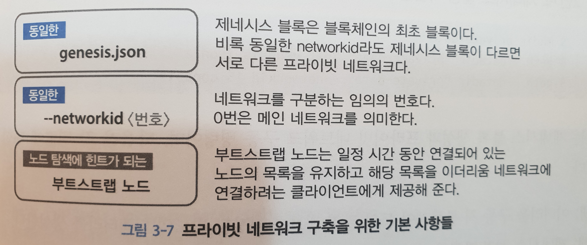
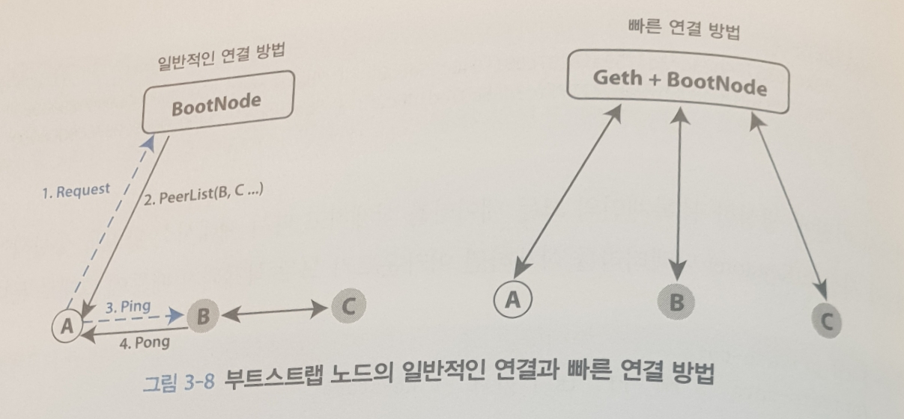
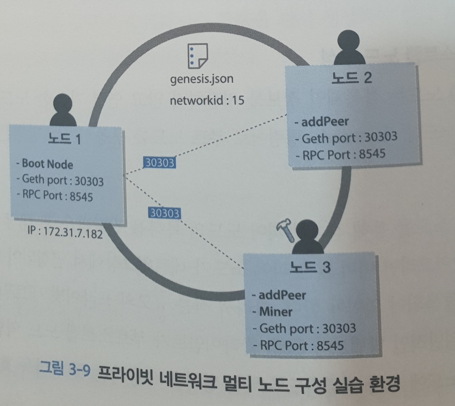

# Chapter 03 이더리움 실습

## 3.1 이더리움 시작

- 이더리움은 Go, C++, Python, Java 버전의 클라이언트를 지원한다.
- 이 책에서는 Go 언어로 작성된 Geth를 설치해 이더리움 플랫폼의 활용법을 살펴본다.

## 3.1.1 Geth 설치

[https://github.com/ethereum/go-ethereum/wiki/Building-Ethereum](https://github.com/ethereum/go-ethereum/wiki/Building-Ethereum)

```sh
brew tap ethereum/ethereum
brew install ethereum
```

mac이 아니라면 ubuntu 환경에서 다음 명령어를 사용하면 됨.

```sh
apt-get update
apt-get install -y software-properties-common
add-apt-repository -y ppa:ethereum/ethereum
apt-get update
apt-get install -y ethereum
```

> 책에는 go를 설치하고 geth를 설치하라고 되어 있는데 불필요한거 같아서 생략

Geth 실행 파일 이외에 Geth에서 사용하는 데이터는 맥의 경우 `~/Library/Ethereum`, 리눅스의 경우 `~/Ethereum`에 저장된다.

```
~/Library/Ethereum
├── geth
│   ├── chaindata
│   ├── ethash
│   ├── nodekey
│   ├── nodes
└── keystore
```

1. chaindata
	- 이더리움 네트워크 동기화 시 블록체인 데이터를 저장하는 장소
2. ethash
	- DAG 파일이 저장된다.
	- 최대 2GB 사이즈의 DAG 파일을 만들어 메모리를 미리 할당한다.
3. keystore
	- 어카운트의 개인 키를 저장한다.

## 3.1.2 Geth 구동

Geth는 이더리움 전체 기능을 사용할 수 있는 애플리케이션으로 CLI를 통해 대화 형태로 쉽게 이더리움 네트워크와 명령을 주고 받을 수 있다.

```sh
$ geth --help
NAME:
   geth - the go-ethereum command line interface
   Copyright 2013-2018 The go-ethereum Authors

USAGE:
   geth [options] command [command options] [arguments...]
```

간단히 geth 콘솔 모드에 진입해보자.

- 표준 에러를 /dev/null로 보내 화면에 에러 로그가 출력되지 않도록 실행한다.

```
$ geth console 2 >> /dev/null
> exit
```

또한 이미 작동 중인 geth 노드의 콘솔에 원격으로 연결하여 콘솔 모드를 이용할 수도 있다.

```
$ geth attach [ipc:/some/custom/path | rpc:http://127.0.0.1:8545]
> exit
```

비대화형 모드로 특정 js파일을 실행할 수도 있다.

```
$ geth js demo.js 2 >> tmp.log
> exit
```

이제 필요한 커맨드라인 옵션들을 주고 Geth를 구동시킨다.

```
$ geth --rpc --rpcport "8485" --rpccorsdomain "*" --datadir "private-dir" --port "30303" --nodiscover --rpcapi "db,eth,net,web3" --networkid 15 console
> exit
```

1. rpc
	- RPC 인터페이스를 가능하게 함
2. rpcport "8485"
	- RPC 포트
3. rpccorsdomain "*"
	- 접속 가능한 RPC 클라이언트 지정
	- *보다 URL을 지정하는게 보안상으로는 좋다.
4. datadir
	- 커스텀 데이터 디렉터리 지정
5. nodiscover
	- 같은 제네시스 블록과 네트워크 ID에 있는 블록에 대한 연결 방지
6. rpcapi "db,eth,net,web3"
	- RPC에 의해서 접근을 허락할 API
7. networkid 15
8. console
	- 출력을 콘솔로 함

## 3.1.3 Geth 커맨드라인 실습

geth 클라이언트 콘솔에서 자바 스크립트를 통해 Jay가 Sujie에게 이더를 송금하는 것을 실행해보자.

별도의 옵션 없이 Geth를 실행할 경우, 풀싱크 모드로 수행되기 때문에 개발자 네트워크에 접속한다.

- 개발자 네트워크는 데이터 싱크가 없고 채굴을 통해 이더를 모으기가 쉽다.

```sh
# 책 내용대로 해서 안되서 변경함
$ geth --networkid "123" --datadir "eth_testdata" --testnet console
> eth.accounts
[ ]
# 현재 생성되어 있는 블록의 개수
> eth.blockNumber
0
```

송신자 Jay 어카운트를 생성하고 Jay 노드가 채굴에 성공하면 이더를 저장할 기본 어카운트인 코인베이스로 지정한다.

```sh
> personal.newAccount("Jay")
"0x7e17d2ec4817c3bc822dac0d46486d0726184890"
> eth.accounts
["0x7e17d2ec4817c3bc822dac0d46486d0726184890"]
> miner.setEtherbase(eth.accounts[0])
true
> personal.newAccount("Sujie")
"0x5d6966245ed1c0ac0b9ba71b30beabb4e2c9cb37"
> eth.accounts
["0x7e17d2ec4817c3bc822dac0d46486d0726184890", 
 "0x5d6966245ed1c0ac0b9ba71b30beabb4e2c9cb37"]
> eth.getBalance(eth.accounts[0])
0
> eth.getBalance(eth.accounts[1])
0
```

채굴해서 잔고를 채우고 잠시 후에 채굴을 종료한다.

```sh
> miner.start(4)
null
INFO [11-11|16:55:49.358] Updated mining threads                   threads=4
INFO [11-11|16:55:49.358] Transaction pool price threshold updated price=1000000000
INFO [11-11|16:55:49.358] Commit new mining work                   number=1 sealhash=65f0fb…b701c4 uncles=0 txs=0 gas=0 fees=0 elapsed=222.108µs
INFO [11-11|16:55:51.719] Generating DAG in progress               epoch=0 percentage=0 elapsed=1.722s
INFO [11-11|16:55:53.490] Generating DAG in progress               epoch=0 percentage=1 elapsed=3.489s
INFO [11-11|16:55:55.295] Generating DAG in progress               epoch=0 percentage=2 elapsed=5.299s
INFO [11-11|16:55:57.064] Generating DAG in progress               epoch=0 percentage=3 elapsed=7.068s
INFO [11-11|16:55:58.855] Generating DAG in progress               epoch=0 percentage=4 elapsed=8.859s
INFO [11-11|16:56:00.641] Generating DAG in progress               epoch=0 percentage=5 elapsed=10.645s
...
> miner.stop()
true
> eth.getBalance(eth.accounts[0])
100000000000000000000
# 기본적으로 Wei 단위로 표시되기 때문에 Ether로 변환해보자
> web3.fromWei(eth.getBalance(eth.coinbase), "ether")
100
```

Sujie에게 1이더를 송금한다.

```sh
> a1 = eth.accounts[0]
"0x7e17d2ec4817c3bc822dac0d46486d0726184890"
> a2 = eth.accounts[1]
"0x5d6966245ed1c0ac0b9ba71b30beabb4e2c9cb37"
> eth.sendTransaction({from: a1, to: a2, value: web3.toWei(1, 'ether'),
...... gasLimit: 30400, gasPrice: 10000000000000})
Error: authentication needed: password or unlock
    at web3.js:3143:20
    at web3.js:6347:15
    at web3.js:5081:36
    at <anonymous>:1:1
```

트랜잭션을 실행하면 어카운트에 Lock이 걸려있다는 메시지가 출력된다. 언락하자.

```
> personal.unlockAccount(a1)
Unlock account 0x7e17d2ec4817c3bc822dac0d46486d0726184890
Passphrase:
true
```

```
> eth.sendTransaction({from: a1, to: a2, value: web3.toWei(1, 'ether'),
	gasLimit: 30400, gasPrice: 10000000000000})
INFO [11-11|17:07:26.300] Setting new local account                address=0x7e17D2EC4817c3bC822daC0d46486D0726184890
INFO [11-11|17:07:26.300] Submitted transaction                    fullhash=0x89f1fcb0989ba4f12989eee5e9f6940880dedcef7c1ab584c319e214c1b365b9 recipient=0x5D6966245ED1c0aC0b9BA71B30bEabB4E2C9cB37
"0x89f1fcb0989ba4f12989eee5e9f6940880dedcef7c1ab584c319e214c1b365b9"
```

여기서 sujie 어카운트의 잔액을 조회하면 여전히 0이다.

- 트랜잭션이 바로 수행되지 않고 대기에 있기 때문, 트랜잭션 실행을 위해서는 마이닝 작업을 진행해야 한다.

```
> eth.getBalance(a2)
0
> eth.pendingTransactions
[{
    blockHash: null,
    blockNumber: null,
    from: "0x7e17d2ec4817c3bc822dac0d46486d0726184890",
    gas: 90000,
    gasPrice: 10000000000000,
    hash: "0x89f1fcb0989ba4f12989eee5e9f6940880dedcef7c1ab584c319e214c1b365b9",
    input: "0x",
    nonce: 0,
    r: "0x2a859f8890d8426483029fb8f89476bb64718f7317e210d1dc69f1e5b26a6147",
    s: "0x295551e57dc7e0aeee5c79218c824dab4d17e838b7a2caf9538249bde64be2a5",
    to: "0x5d6966245ed1c0ac0b9ba71b30beabb4e2c9cb37",
    transactionIndex: 0,
    v: "0x2a",
    value: 1000000000000000000
}]
```

트랜잭션을 완료하기 위해 마이닝 작업을 수행하고, 처리되었는지 확인한다.

```sh
> miner.start(4)
INFO [11-11|17:09:54.569] Updated mining threads                   threads=4
INFO [11-11|17:09:54.569] Transaction pool price threshold updated price=1000000000
null
> INFO [11-11|17:09:54.570] Commit new mining work                   number=21 sealhash=8aad2a…6ff111 uncles=0 txs=0 gas=0 fees=0 elapsed=130.34µs
INFO [11-11|17:09:54.570] Commit new mining work                   number=21 sealhash=2c27fa…58d428 uncles=0 txs=1 gas=21000 fees=0.21 elapsed=453.799µs
INFO [11-11|17:09:58.355] Successfully sealed new block            number=21 sealhash=2c27fa…58d428 hash=2e4652…7788f1 elapsed=3.785s
INFO [11-11|17:09:58.356] 🔗 block reached canonical chain          number=14 hash=32bb3d…9bb082
INFO [11-11|17:09:58.356] 🔨 mined potential block                  number=21 hash=2e4652…7788f1
INFO [11-11|17:09:58.356] Commit new mining work                   number=22 sealhash=4c4ca4…ecf3c8 uncles=0 txs=0 gas=0     fees=0    elapsed=220.409µs
miner.stoINFO [11-11|17:10:03.285] Successfully sealed new block            number=22 sealhash=4c4ca4…ecf3c8 hash=6b1a38…079a89 elapsed=4.928s
INFO [11-11|17:10:03.285] 🔗 block reached canonical chain          number=15 hash=34284d…0d171c
INFO [11-11|17:10:03.285] 🔨 mined potential block                  number=22 hash=6b1a38…079a89
INFO [11-11|17:10:03.285] Commit new mining work                   number=23 sealhash=57fbd8…b7afc3 uncles=0 txs=0 gas=0     fees=0    elapsed=169.544µs
> miner.stop()
null
> eth.pendingTransactions
[]
> eth.getBalance(a2)
1000000000000000000
> eth.getBalance(a1)
109000000000000000000
>
```

## 3.2 이더리움 네트워크 접속

이더리움은 크게 메인넷과 테스트넷, 그리고 프라이빗 네트워크 세 가지 종류가 있다.

## 3.2.1 메인 네트워크 접속

geth 실행 시 아무 옵션도 주지 않으면 메인 네트워크에 접속한다.

- fast나 cache 옵션으로 동기화하는데 걸리는 시간을 단축할 수 있다.

```sh
# fast는 상태 정보만 다운로드 한다.
$ geth --syncmode "fast"  --cache 1024 console
```

## 3.2.2 테스트 네트워크 접속

테스트 네트워크로는 Rinkeby와 Ropsten을 주로 사용한다.

- Ropsten은 PoW(Proof of Work) 테스트
- Rinkeby는 PoA(Proof of Autority) 테스트

```
# Ropsten --networkid 3을 지정해도 된다.
$ geth --testnet --syncmode "fast" --cache 512 console
# Rinkeby, --networkid 4을 지정해도 된다.
$ geth --rinkeby --syncmode "fast" --cache 512 console
```

## 3.2.3 프라이빗 네트워크 접속

### 솔로 네트워크 접속하기

솔로 네트워크는 개발 테스트를 진행할 때 주로 사용한다.

```
$ geth --dev --syncmode fast --cache=512 console
```

### 프라이빗 네트워크 구축하기

메인 네트워크가 아닌 별도의 피어들로 구성된 독자적인 네트워크를 구성할 때는 프라이빗 네트워크를 사용한다.

프라이빗 네트워크를 구성하기 위해 기본적으로 갖추어야 할 사항은 다음과 같다.



먼저 제네시스 파일을 생성한다.

```json
{
  "config": {
    "chainId": 15,
    "homesteadBlock": 0,
    "eip155Block": 0,
    "eip158Block": 0
  },
  "difficulty": "200000000",
  "gasLimit": "3100000",
  "alloc": {}
}
```

제네시스 설정 파일을 이용하여 최초 블록을 생성하고 프라이빗 네트워크에 접속한다.

```
$ mkdir private-data
$ geth --datadir "private-data" init genesis.json
# networkid를 별도로 지정하지 않으면 메인 네트워크로 접속된다.
$ geth --datadir "private-data" --networkid 15 console
```

신규로 생성한 네트워크에서 특정 어카운트에 초기 이더를 할당해주기 위해서는 제네시스 설정 파일의 alloc 부분을 수정하여 제네시스 블록을 다시 생성해야 한다.

```
> personal.newAccount("A")
"0xf09354ce6b7a31d4c407c489313a88103a6a8a91"
> personal.newAccount("B")
"0xc647e8d0cad1990b991560a281250c7d83338cf3"
```

신규로 생성한 어카운트의 주소에 이더를 할당하도록 수정하고 재구동하여 네트워크를 다시 만든다.

- 이 때 private-data 디렉토리에서 keystore를 제외하고 다른 디렉토리는 다 삭제한다.

```json
{
  "config": {
    "chainId": 15,
    "homesteadBlock": 0,
    "eip155Block": 0,
    "eip158Block": 0
  },
  "difficulty": "200000000",
  "gasLimit": "3100000",
  "alloc": {
  	"0xf09354ce6b7a31d4c407c489313a88103a6a8a91": {"balance": "300000000000000000000"},
  	"0xc647e8d0cad1990b991560a281250c7d83338cf3": {"balance": "400000000000000000000"}
  }
}
```

```sh
$ cd private-data
$ rm -rf `ls | grep -v keystore`
$ cd ..
$ geth --datadir "private-data" init genesis.json
$ geth --datadir "private-data" --networkid 15 console
```

콘솔에서 확인해보면 해당 어카운트에 이더가 이미 할당되 있는 것을 확인할 수 있다.

```
> web3.fromWei(eth.getBalance(eth.accounts[0]), "ether");
300
> web3.fromWei(eth.getBalance(eth.accounts[1]), "ether");
400
```

부트스트랩 노드는 블록체인 정보를 저장하지 않고 연결 가능한 노드들의 목록만을 저장하는 특수한 노드다.

- 일반적으로는 네트워크의 규모가 크기 때문에, 부트 노드를 통해 접속할 피어 노드의 목록을 전달받은 후 해당 피어 노드의 블록 체인 데이터를 받아온다.
- 작은 규모의 프라이빗 네트워크에서는 Geth 클라이언트가 부트 스트랩 노드 역할을 하고 다른 노드들이 이 Geth 노드에 항상 연결되도록 하는 것이 효과적이다.



> 다음 장에서 별도의 부트 스트랩 노드 없이 Geth 클라이언트를 활용하여 빠르게 프라이빗 네트워크를 구축하는 방법에 대해 설펴보자.

## 3.2.4 프라이빗 네트워크에 멀티 노드 구성 실습

서로 다른 호스트 3대를 동일 프라이빗 네트워크로 실제 구성해보자.

- 동일한 제네시스 파일로 최초 블록을 만들고
- --networkid가 동일해야 하고
- 부트 노드를 공통으로 지정해 멤버 노드들이 동일한 부트 노드를 통해 연결되도록 한다.



### 노드 1(부트노드)

앞의 genesis.json을 그대로 활용한다.

```sh
$ geth --datadir "private-data" init genesis.json
$ geth --datadir "private-data" --networkid 15 console
# 노드 1의 enode URI를 확인한다.
> admin.nodeInfo.enode
"enode://03b56ece7cacce28c146d5f77c6c0d5da166d86c6481042b0e6f04139ed9d2ef0f12fa2cc506f129264514f38ad209a785ee365f4d114545977d560dcd916de9@[::]:30303"
```

### 노드 2(일반 노드)

Geth를 구동시키고 addPeer로 부트 노드와 P2P 연결을 한다.

```sh
$ geth --datadir "private-data" init genesis.json
$ geth --datadir "private-data" --port 30304 --networkid 15 console
# 실시간으로 부트 노드를 연결한다.
> admin.addPeer("enode://03b56ece7cacce28c146d5f77c6c0d5da166d86c6481042b0e6f04139ed9d2ef0f12fa2cc506f129264514f38ad209a785ee365f4d114545977d560dcd916de9@[::]:30303")
true
```

### 노드 3(마이너 노드)

노드 2와 동일하다

```
$ geth --datadir "private-data" init genesis.json
$ geth --datadir "private-data" --port 30304 --networkid 15 console
# 실시간으로 부트 노드를 연결한다.
> admin.addPeer("enode://03b56ece7cacce28c146d5f77c6c0d5da166d86c6481042b0e6f04139ed9d2ef0f12fa2cc506f129264514f38ad209a785ee365f4d114545977d560dcd916de9@[::]:30303")
true
```

그리고 마이너를 구동시킨다.

```
> personal.newAccount("C")
"0x1749000743f63b80cdd53136ca6ef6af6679236f"
> miner.setEtherbase(eth.accounts[0])
true
> eth.coinbase
"0x1749000743f63b80cdd53136ca6ef6af6679236f"
> miner.start(1)
```

제대로 프라이빗 네트워크가 연결되었는지 노드 1 Geth 콘솔에서 확인해보자.

```
> net.peerCount
3
> admin.peers
[{
    caps: ["eth/63"],
    enode: "enode://363414e07f9b59c7610fb896356f2bde89db24e1b32724eae7b0eb02d21a91c23d25254732fce1e41983a7c88b4bec0d3be90765f75ce3e54c5f06c5497c11bf@[::1]:51758",
    id: "e6852c3ecd52646abd713ede8c4b4e638b88945fe53d637337c3c471f4d26ac6",
    name: "Geth/v1.8.17-stable/darwin-amd64/go1.11.1",
    network: {
      inbound: true,
      localAddress: "[::1]:30303",
      remoteAddress: "[::1]:51758",
      static: false,
      trusted: false
    },
    protocols: {
      eth: {
        difficulty: 200000000,
        head: "0xc80fb2dd5b4be44855891b3e5ce4c19818976b874a044ce1dfd42cc6f56b6ffd",
        version: 63
      }
    }
}, {
    caps: ["eth/63"],
    enode: "enode://10cbede48a7f5882d4ef395656f892c45ec254ccebe890a9fe50b14f69f78966687620458f4de35fdbcbd3d7674da3d32e3bcd64af6a9c9f5e8bf798f51dc398@[::1]:51536",
    id: "fd5298108d7387488c7f34c21f60944ea75c9b6fd95de51e9c67cce963f5eac9",
    name: "Geth/v1.8.17-stable/darwin-amd64/go1.11.1",
    network: {
      inbound: true,
      localAddress: "[::1]:30303",
      remoteAddress: "[::1]:51536",
      static: false,
      trusted: false
    },
    protocols: {
      eth: {
        difficulty: 200000000,
        head: "0xc80fb2dd5b4be44855891b3e5ce4c19818976b874a044ce1dfd42cc6f56b6ffd",
        version: 63
      }
    }
}]
```

마지막으로, 노드 1의 어카운트에서 노드 3의 어카운트로 송금을 실행해 제대로 이루어졌는지 확인한다.

```
> personal.unlockAccount(eth.coinbase)
Unlock account 0xf09354ce6b7a31d4c407c489313a88103a6a8a91
Passphrase:
true
> eth.sendTransaction({from: eth.coinbase, to: "0x1749000743f63b80cdd53136ca6ef6af6679236f", value: web3.toWei(1, "ether")})
INFO [11-11|17:46:55.735] Setting new local account                address=0xF09354CE6b7a31d4C407C489313a88103A6A8A91
INFO [11-11|17:46:55.736] Submitted transaction                    fullhash=0x2f838bf2def52bf3d5e86b4ffe2535f4c77d2216e1e3a0ab9a4a205e48b2130a recipient=0x1749000743f63b80Cdd53136cA6eF6Af6679236f
"0x2f838bf2def52bf3d5e86b4ffe2535f4c77d2216e1e3a0ab9a4a205e48b2130a"
```

> 여기서 채굴이 안된다.. 이유는 모르겠...