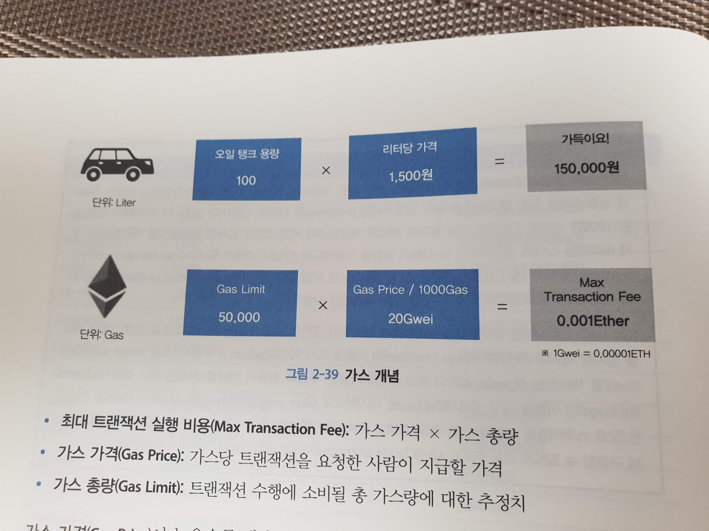

# 2.3 이더리움 플랫폼 구성

## 2.3.1 데이터 계층

## Account

이더리움 플랫폼에서 Account는 모든 Transaction의 실행 주체이자 기본 단위로서 모든 것은 Account에서 시작한다.


### EOA, Externally Owned Account

- 책에서는 Account라고 부른다.
- 일반적으로 말하는 Etherium 사용자 Account가 EOA
- Smart Contract 실행 코드를 가지고 있지 않다.
- 사람이 직접 private key로 관리
    - 분실 시 해당 Account도 분실한 것이 됨
- EOA는 private key를 사용하여 전자 서명된 Transaction을 생성하고 실행
    - 이를 통해 다른 EOA에 이더를 전송하거나
    - Contract Account에 메시지를 보내 해당 코드를 실행

### CA, Contract Account

- 책에서는 Contract 또는 Smart Contract라고 부른다.
- Smart Contract의 정식 용어
- EOA나 다른 CA의 메시지를 받아 내부의 Smart Contract 코드를 실행한다.
    - 이후, 코드 내에서 내부 저장 공간에 데이터를 저장하거나
    - 새로운 Contract를 생성한다.

## Account(Cont.)

Account는 다음과 같은 형태이 20바이트의 주소를 갖는다.

```
0xp89daa0987da987s09a7sdf098s70f9a87sdf8as7f
```

### Account 주소

```go
// 패키지: accounts, 파일명: accounts.go
type Account struct {
    Address common.Address  `json:"address"`
    // URL은 해당 주소의 위치를 나타내며 옵션 사항이다.
    URL     URL             `json:"url"`
}

// 패키지: Common, 파일명: Types.go
const AddressLength = 20   // 이더리움 Address는 20 byte 주소임
type Address [AddressLength]byte
```

### Account 정보

```go
// 패키지: core/state, 파일명; state_object.go
type Account struct {
    // 해당 Account로부터 보내진 Transaction 수를 의미(0으로 시작)
    // Transaction이 무제한 실행될 때는 의미가 없으나 
    // 오직 한 번만 실행되게 할 때 사용할 수 있는 카운터
    // 만약 CA이면 Nounce는 Account에 의해 생성된 Contract 수이다.
    Nonce   uint64
    // 이더 잔고(Wei 기준)
    Balance *bit.Int
    // 해당 Account가 저장될 머클 패트리시아 트리의 루트 노드
    // 이 트리의 루트 노드를 암호 해시한 것이 바로 Root이다.
    // 암호 해시는 Keccak256 암호 해시를 사용
    Root    common.Hash   
    // 해당 Account의 Smart Contract ㅂ이트 코드의 해시를 말함
    // EOA의 경우 코드 해시값이 nil
    CodeHash []byte
}
```

## Account 생성

모든 이더리움 Account는 private key와 public key의 쌍으로 정의된다.

> 개인 키와 공개 키를 asymmetric key라고 한다. 

이더리움은 asymmetric algorithm으로 256비트 ECDSA(타원형 곡선 방식) 을 사용한다.

1. 임의의 private key를 만들어낸다.
2. ECDSA 알고리즘으로 private key로부터 256비트 public key를 생성한다.
3. 암호 해시 알고리즘 Keccak256을 사용하여 public key을 암호화해 32바이트의 고정값을 생성
4. 이 중 20바이트를 절삭해 Account Address로 사용


## Accounts 패키지: Account 생성

`Accounts/keyStore` 패키지는 Account 키의 저장 디렉터리의 관리를 담당한다.

- *NewAccount()* 는 암호화를 하기 위한 키값을 변수 passpharase로 전달받고
- *storeNewKey()* 함수를 호출한다.
- *newKey()* 함수를 호출하여 임의의 문자열로 키를 생성하고 이를 저장한다.

```go
// 패키지: Accounts/KeyStore, 파일명: keystore.go
func (ks *KeyStore) NewAccount(passphrase string) (accounts.Account, error) {
    // (1) storeNewKey() 함수를 호출
    _, account, err := storeNewKey(ks.storage, crand.Reader, passphrase) 
    // ...
}

func storeNewKey(ks KeyStore, rand io.Reader, auth string) (*Key, accounts.Account, error) {
    // (2) 키를 생성한다.
    key, err := newKey(rand)
    if err != nil {
        return nil, accounts.Account{}, err
    }
    a := accounts.Account{
        Address: key.Address,
        URL: accounts.URL{
            Scheme: KeyStoreScheme,
            Path: ks.JoinPath(keyFileName(key.Address)) 
        }
    }
    // (3) 키를 저장한다
    if err := ks.StoreKey(a.URL.Path, key, auth); err != nil {
        zeroKey(key.PrivateKey)
        return nil, a, err
    }
    return key, a, err
}
```


```go
// 패키지: Accounts/KeyStore, 파일명: key.go
func newKey(rand io.Reader) (*Key, error) {
    // (3) 임의의 문자열을 매개변수로 임의의 256비트 private key 생성
    privateKeyECDSA, err := ecdsa.GenerateKey(crypto.S256(), rand)
    if err != nil {
        return nil, err
    }
    // (4) public key 생성
    return newKeyFromECDSA(privateKeyECDSA), nil
}

func newKeyFromECDSA(privateKeyECDSA *ecdsa.PrivateKey) *Key {
    id := uuid.NewRandom()
    // (5) 128비트 UUID를 생성한 후에 UUID와 Address와 
    //     PrivateKey로 구성된 Key 구조체의 포인터 반환
    key := &Key{
        Id:         id,
        Address:    crypto.PubkeyToAddress(privateKeyECDSA.publicKey),
        PrivateKey: privateKeyECDSA,
    }
    return key
}

func PubkeyToAddress(p ecdsa.PublicKey) common.Address {
    pubBytes := FromECDSAPub(&p)
    // (6) Pubkey를 받아 Keccak 암호 해싱한 뒤 ByteToAdress 호출
    return common.BytesToAddress(Keccak256(pubBytes[1:])[12:])
}

type Address [AddressLength]byte

func ByteToAddress(b []byte) Address {
    var a Address
    // (7) SetByte 함수로 Account Address 설정
    a.SetBytes(b)
    return a
}

func (a *Address) SetBytes(b []byte) {
    // ...
    // (8) 뒷부분 20바이트만을 최종 Account로 잘라서 반환
    copy(a[AddressLength-len(b):], b)
}
```

## Account 상태

Account들이 모인 것을 이더리움에서는 상태(state)라고 하고 이를 *stateObject* 구조체로 저장한다.

- *stateObject*를 통해 Account에 접근하여 상태를 변경
- Account 변경 후에 *CommitTrie()* 함수를 호출하여 
- 변경된 Trie를 ethdb 패키지를 통해 LevelDB에 업데이트한다.

```go
// 패키지: core/state, 파일명: state_object.go
type stateObject struct {
    address  common.Address // Address
    addrHash common.Hash    // Account 주소의 Keccak256 Hash
    data     Account        // 이더리움 Account
    db       *StateDB       // 상태를 저장할 DBMS에 대한 포인터

    // 쓰기용 캐시, 상태 값으로 필요한 데이터의 임시 저장 캐시
    trie Trie  // Trie 저장소
    code Code  // Contract의 바이트코드
}
```

## Transaction

이더리움에서 Transaction은 다른 Account나 Contract에 보낼 데이터 구조체로서,  전사 서명으로 암호화한다.

- 하나의 Account에서 다른 Account로 이더를 전송하거나
- Smart Contract의 특정 함수를 호출할 때 Transaction이 사용된다.
- 새로운 Smart Contract를 이더리움 노드에 배포할 때도 사용된다.

Transaction의 발신자는 ECDSA 서명 알고리즘을 사용하여 개인키로 서명해야 한다.

- 해당 Transaction이 정당한 것(자신이 발신한 것)임을 입증하기 위해서

이더리움의 경우 중첩된 바이너리 배열 데이터를 효과적으로 처리하기 위해 RLP라는 자체 인코딩 방식을 사용한다.

> 요건 나중에 설명이 나온다고 함


## core 패키지: Transaction 생성 및 전자 서명

다음은 이더리움에서 사용하는 Transaction의 구조체이다.

```go
// 패키지: core/types, 파일명: transaction.go
type Transaction struct {
    data txdata    
    hash atomic.Value // Transaction 해시값
    Size atomic.Value
    from atomic.Value // 발신자 주소
}

type txdata struct {
    // 발신자에 의해 보내진 트랜잭션의 개수. 0으로 시작
    AccountNonce uint64
    
    // *실제 Transaction의 실행 비용은 `Price * GasLimit`로 계산
    // Transaction의 발신자가 각 실행 단계에서 지급하는 가스 가격
    Price        *big.Int
    // Transaction 수행 시 지급 가능한 최대 범위
    GasLimit     *big.Int

    // 메시지 수신처의 Address
    // nil일 경우 수신자가 Contract임을 의미
    Reciptent    *common.Address
    // 수신자에게 전송할 이더의 양
    Amount       *big.Int
    // 메시지 호출 시 매개변수 등이 전달(option)
    // 배포 시에는 Smart Contract의 초기화 코드도 포함 가능
    Payload      []byte

    // ECDSA 전자 서명을 위한 값들
    V *big.Int
    R *big.Int
    S *big.Int
    
    // ...
}
```

*SignTX()* 함수는 서명자와 서명자의 개인키를 사용하여 서명된 새로운 트랜잭션을 반환한다.

```go
// 패키지: core/types, 파일명: transaction_signing.go
func SignTx(tx *Transaction, s Signer, prv *ecdsa.PrivateKey) (*Transaction, error) {
    h := s.Hash(tx)
    // (1) Hash와 Private Key를 사용해 서명
    sig, err := crypto.Sign(h[:], prv)
    if err != nil {
        return nil, err
    }
    // (2) raw tx를 sig로 signing
    return tx.WithSignature(s, sig)
}

func (tx *Transaction) WithSignature(signer Signer, sig []byte) (*Transaction, error) {
    r, s, v, err := signer.SignatureValues(tx, sig)
    if err != nil {
        return nil, err
    }
    cpy := &Transaction{ data: tx.data }
    // (3) R, S, V 전자 서명값 설정
    cpy.data.R, cpy.data.S, cpy.data.V = r, s, v
    return cpy, nil
}
```

## Receipt

> 우리가 현실 세계에서 물건을 구매하면 영수증을 받듯이 이더리움은 모든 Transaction의 로그를 Receipt에 저장한다.

Recept에는 Transaction과 관련된 실행환경과 검색을 위한 인덱싱 등 블록 내에 정상 등록된 트랜잭션에 대한 정보들이 저장된다.


```go
// 패키지: core/types, 파일명: receipt.go
type Receipt struct {
    // Transaction 처리 후의 상태 정보
    PostState         []byte
    // Transaction 처리 후 실패 여부
    Failed            bool
    // 해당 Transaction과 Receipt를 포함하고 있는 블록에서
    // 사용한 누적 가스 비용
    CumulativeGasUsed *big.Int
    // Logs에 저장된 로그 정보들을 빠르게 검색하는데 사용하기 위한 블룸 필터
    Bloom             Bloom
    // Transaction의 실행 과정에서 생성된 로그들
    Logs              []*Log
    // 해당 Transactiondml 주소
    TxHash            common.Hash
    // Smart Contract의 주소(CA로부터 생성됬을 경우)
    ContractAddress   common.Address
    // 해당 Transaction 실행에 사용된 가스 비용
    GasUsed           *big.Int
}
```

## 블록체인

이더리움에서 Account의 상태 전이를 유발하는 Transaction들과 관련 정보는 블록이라는 구조체에 저장된다.

- 이 블록들은 시간순으로 마치 체인처럼 서로 연결되어 있다.
- 이렇게 연결된 블록들을 Block Chain이라 부른다.
- Block Chain은 네트워크에 연결되어 있는 모든 노드에 전파/공유 된다.
- 결국, 블록체인이 공유 원장이다.

## 블록

이더리움에서 블록은 *블록 해더*, *엉클 블록*, *Transaction*으로 구성된다.

- 또한 마이닝 작업의 난이도 등도 포함

[https://etherscan.io/block/4246458](https://etherscan.io/block/4246458)

이더리움 블록의 데이터 구조체는 다음과 같다.

```go
// 패키지: core/types, 파일명: block.go
type Block struct {
    header        *Header
    uncles        []*Header
    transactions  Transactions
    // ...
    // 난이도 총합(total difficulty)
    td            *big.Int
}

// 블록 해더에 실제 주요 정보 대부분이 저장되어 있다.
// 블록 해더 내의 해시값은 모두 Keccak256 해시 함수의 결과를 말한다.

type BlockNonce [8]byte
type Bloom [32]byte

type Header struct {
    // 부모 블록 헤더
    parentHash   common.Hash 
    // 엉클 블록들의 해시값
    uncleHash    common.Hash 
    // 마이닝 작업 후 이더를 지급받을 Account 주소
    Coinbase     common.Address 
    // Account의 상태 정보가 모여 있는 머클 패트리시아 트리의 루트 노드
    Root         common.Hash
    // Transaction이 모여 있는 머클 패트리시아 트리의 루트 노드
    TxHash       common.Hash
    // Recept들이 모여 있는 머클 패트리시아 트리의 루트 노드
    ReceiptHash  common.Hash
    // 로그 정보들을 검색하는데 사용하는 32바이트 블룸 필터
    Bloom        Bloom
    // 현재 블록의 난이도
    Difficulty   *big.Int
    // 현재 블록의 번호(제네시스 블록은 0번)
    Number       *big.Int
    // 블록당 현재 지급 가능한 최대 가스 총합
    GasLimit     *big.Int
    // 현재 블록 내에 Transaction에 의해 사용된 가스의 총합
    GasUsed      *big.Int
    // 현재 블록의 최초 생성 시간을 기록
    Time         *big.Int
    // 추가 정보
    Extra        []byte
    // Nonce와 MixDigest는 블록 생성을 위한 마이닝 작업시 사용된다.
    MixDigest    common.Hash
    Nonce        BlockNonce
}
```

## 블룸 필터

> [블룸 필터란?](https://namu.wiki/w/%EB%B8%94%EB%A3%B8%20%ED%95%84%ED%84%B0)

이더리움에서는 256비트 블룸 필터를 사용한다.

- 트랜잭션 목록이나 해당 트랜잭션들에서 생성된 로그들이 중복 저장되는 것을 막고 쉽게 찾을 수 있음
- 로그의 필드들을 색인해 필터에 추가

이렇게 하면 로그를 블록 내에 직접 저장하지 않게 되어 저장 공간을 절약할 수 있음

## Genesis Block

Genesis Block은 블록체인에서 첫 번째에 위치한 최초 블록을 말한다.

- 이전 블록이 없음
- 블록 넘버는 0
- 트랜젝션 없음

다음은 제네시스 블록의 구조체이다.

```go
// 패키지: core, 파일명: genesis.go
type Genesis struct {
    Config      *params.ChainConfig // <--
    Nonce       uint64
    Timestamp   uint64
    ExtraData   []byte
    GasLimit    uint64
    // nonce 값을 찾기 위한 마이닝 계산 시의 목푯값
    Difficulty  *big.Int
    Mixhash     common.Hash
    Coinbase    common.Address
    // 일정 양의 이더를 특정 어카운트에 미리 할당할 수 있다.
    // 사전 판매 시에 유용하게 사용
    Alloc       GenesisAlloc
    Number      uint64
    GasUsed     uint64
    // Genesis block은 이 값이 없다.
    ParentHash  common.Hash
}
```

이더리움 클라이언트들은 같은 제네시스 블록을 가지고 있을 때만 서로를 연결하고 블록들을 싱크한다.

- 따라서 제네시스 블록이 다르면 다른 시스템이다.
- 이런 식으로 private network를 구축할 수 있다.

Geth 같은 이더리움 클라이언트는 *genesis.json* 를 사용해 제네시스 블록을 생성한다.

```json
{
    "config": {
        "chainId": 0,
        "homesteadBlock": 0,
        "eip155Block": 0,
        "eip158Block": 0
    },
    "alloc" : {},
    "coinbase" : "0x0000",
    "difficulty" : "0x20000",
    "extraData" :"",
    "gasLimit" : "0xfefd8",
    "nonce": "0x000000042",
    "mixhash": "0x000",
    "parentHash": "0x000",
    "timestamp": "0x00"
}
```

다음과 같이 Geth 클라이언트를 구동하면 Genesis block을 생성하고 Private Network를 시작할 수 있다.

```sh
$ geth --datadir "private-data" init genesis.json
$ geth --datadir "private-data" --networkid 15
```

## 엉클 블록

*블록 생성에 성공* 하였고 검증에 오류가 없어 네트워크를 통해 *브로드캐스팅* 되었으나 다른 마이너가 생성한 다른 블록에 비해 *난이도가 낮아 등록되지 못한 블록* 을 `Uncle Block`이라 한다.

- 비트코인에서는 스테일 블록 혹은 고아 블록이라 한다.

엉클 블록이 많으면 여러 문제를 일으킨다.

1. Transaction 처리를 지연시킨다.
    - 두 명의 마이너가 거의 같은 시간에 블록을 채굴할 때 마이너들의 블록에는 다른 트랜잭션이 포함된다.
    - 엉클 블록 내의 트랜잭션은 즉시 처리되지 않는다.
2. 컴퓨팅 파워의 낭비 문제
    - 이 경우 블록 체인은 두 개의 체인으로 분리되고 `길이가 긴 체인` 이 정상으로 등록된다.
    - 짧은 체인은 엉클 블록을 포함한 체인이 되고 이후 블록 모두 엉클 블록이 된다.
    - 엉클 블록의 체인 생성 과정은 `불필요한 해시 계산` 을 한 셈이 된다.
3. 보안 문제
    - 엉클 블록 생성 후 다음 블록을 생성하면 평균 블록 생성 시간이 더 길어진다.
    - 따라서 난이도가 줄어들게 된다.
    - 난이도가 줄어들면 블록타임이 줄어든다.
    - 컴퓨팅 파워가 큰 마이너의 영향력이 커지는 문제가 발생

## 고스트 프로토콜

이더리움은 엉클 블록의 문제를 고스트 알고리즘을 사용해 해결한다.

- 블록 생성 시 정상 블록에 최대 2개의 엉클 블록까지 추가하고 보상한다.

1. 엉클 블록에 대한 보상은 아래처럼 주어진다.
2. 또한 엉클 블록에는 Transaction과 Contract가 포함되지 못한다.


다음은 이더리움에서 사용되는 고스트 알고리즘에 대한 설명이다.

1. 하나의 블록은 반드시 하나의 부모 블록을 지정하며 최대 2개까지 엉클 블록을 지원한다
2. 블록 A에 포함된 엉클 블록은 다음과 같은 속성을 갖는다.
    - 블록 A의 k번째 조상의 직접적인 자손이여야 한다.(2<=k<=7)
        - 실제 한 블록이 생성된 후 블록체인에 등록되고 
        - 최종적으로 반영된 사실이 확인될 때까지 최대 생성 시점 이후 6개의 블록이 체인에 연결될 때까지 기다린다.
        - 이를 `6confirmation` 이라 한다.
        - 엉클 블록 역시 6개의 블록 중 하나에 포함되어야 한다.
    - 블록 A의 조상이여서는 안된다.
    - 엉클 블록은 반드시 유효한 블록 해더를 가져야 한다.

다음은 비잔티움 버전의 보상 계산 방식이다.

```
* 블록의 마이너 보상:
   블록 보상(3) + 트랜잭션 수수료 + 
        엉클 블록 1개당 블록 보상의 3.125%(최대 2개, 0.09375)
* 엉클 블록의 마이너 보상:
   (8 - (정상 블록 번호 - 엉클 블록 번호))/8 * 블록 보상
```

## 블록 체인

이더리움은 블록들을 시간순으로 서로 연결하여 블록체인을 구성한다.

- 앞 블록의 내용이 변경되면 뒤의 블록도 변경해야 하기에, 조작/위변조가 불가능하다.
- Transaction에는 발생한 시간이 명시되기에 거래 사실을 부인할 수 없다.


```go
// 패키지: core, 파일명: blockchain.go
type BlockChain struct {
    config           *params.ChainConfig // 체인의 설정 정보
    chainDb          ethdb.Database      // 체인 정보가 저장될 DB
    // ...
    genesisBlock     *types.Block        
    // ...
    currentBlock     *types.Block        // 블록체인의 현재 헤드
    currentFastBlock *types.Block        // 패스트 싱크 체인의 현재 해드
    engine           consensus.Engine    // 합의 엔진
    processor        Processor           // 블록 프로세서 인터페이스
    validator        Validator
    vmConfig         vm.Config
    // ...
}
```

최초로 Geth를 설치하고 구동하는 경우에 로컬 컴퓨터상에 블록체인을 구성해야 한다.

```go
// 패키지: cmd/geth, 파일명: main.go
func geth() {
    // ...
    // (1) 블록체인 구성을 위해 makeFullNode 호출
    node := makeFullNode(ctx)
    // ...
}

// 패키지: cmd/geth, 파일명: config.go
func makeFullNode() {
    // ...
    // (2) 이더리움 클라이언트 서비스를 스택에 등록
    utils.RegisterEthService(stack, &cfg.Eth)
    // ...
}

// 패키지: cmd/geth, 파일명: flag.go
func RegisterEthService(stack *node.Node, cfg *eth.Config) {
    if cfg.SyncMode == downloader.LightSync {
        err = stack.Register(func(ctx *node.ServiceContext) (node.Service, error) {
            // (3) LightSync 모드일 경우, 블록의 헤더만 동기화
            return les.New(ctx, cfg)
        })
    } else {
        err = stack.Register(func(ctx *node.ServiceContext) (node.Service, error) {
            // (3) FullSync 모드일 경우, 전체 블록체인을 구축
            fullNode, err := eth.New(ctx, cfg)
            // ...
            return fullNode, err
        })
    }
}

// 패키지: eth, 파일명: backend.go
func New(ctx *node.ServiceContext, config *Config) (*Ethereum, error) {
    // ...
    // (4) NewBlockChain 함수를 호출해 블록체인 구성
    eth.blockchain, err = core.NewBlockChain(chainDb, eth.chainConfig, eth.engine, vmConfig)
}
```

## 블록체인 동기화와 라이트 체인

이더리움에서는 세 가지 동기화 방법을 제공한다.

1. Full sync
    - 전체 블록을 동기화
2. Fast Sync
    - 최근의 상태, 트랜잭션, 리시트 등을 포함하고 있는 블록 해더만을 동기화
    - 이전 히스토리는 모르기에 트랜잭션의 유효성 검증을 불가하다.
    - 가령, A가 20이더를 가지고 있다는건 알지만 어떤 과정으로 그런지는 모른다.
3. Light Sync
    - 현재 상태 정보만 동기화

동기화 방법은 아래처럼 옵션 값으로 지정하여 선택한다.

```sh
$ geth --syncmode "fast"
```

> light sync는 모바일 폰과 같은 저성능 환경에서 구동할 때 사용하는 것을 주 목적으로 개발 중에 있다.

## 머클 패트리시아 트리

블록체인은 모든 데이터를 모두 공유하기 때문에 데이터의 양이 방대할 수 밖에 없다.

이더리움에서는 머클 패트리시아 트리라는 암호 해시 기반의 트리 자료구조를 사용하여 이를 해결한다.

그리고, 트리 내의 모든 정보는 LevelDB에 저장한다.

> 아래 글로 설명하는 것이 빠를 것 같다.
> https://okky.kr/article/464145

머클 패트리시아 트리를 고려한 전체 블록체인의 구조는 다음과 같다.


### 머클 상태 전이 증명

해시 루트를 통해 다양한 질의를 할 수 있다.

1. 해당 트랜잭션이 특정 블록에 포함되어 있는가?
2. 특정 어카운트의 현재 잔액은?
3. 해당 어카운트가 현재 존재하는가?


또한 이를 통해 `머클 상태 전이 증명(MSTP)`을 할 수 있다.

- 가상으로 특정 컨트랙트의 트랜잭션을 실행하고 결과를 확인하는 것

```
만일 상태 루트 S 상에서 트랜잭션 T를 실행했다면,
그 결과는 로그 L과 아웃풋 O를 갖는 상태 루트 S'이 된다.
```

위의 정의는 상태 트리 루트와 트랜잭션과 리시트 트리 루트에서 관련 정보를 조회해 결과 O를 가상으로 재현해 봄으로써 상태 S'으로의 전이가 맞는지 증명할 수 있다.

1. 로컬 컴퓨터 상에 임의의 가짜 블록을 하나 생성
2. 여기에 임의의 상태 S를 설정한 후 라이트 클라이언트 모드로 특정 트랜잭션을 실행
3. 라이트 클라이언트는 필요한 정보를 `상태, 트랜잭션, 리시트 트리 루트`를 통해 찾는다.
    - 가령, 특정 어카운트의 잔액이 필요하면 조회한다.
4. 이더리움 노드는 요청받은 정보를 라이트 클라이언트에 반환해준다.
5. 라이트 클라이언트는 전달받은 데이터를 사용해 트랜잭션을 재현하고 상태 S'를 생성한다.
6. 상태 S'가 이더리움 노드가 알려준 결과와 같다면 증명을 수용한다.

## 이더와 가스

이더는 암호화폐이고 가스는 이더리움 시스템 운영에 필요한 운영 토큰이다.

- 이더는 시장에서 거래되기에 가격의 변동성이 크다. 
- 따라서 운영에 직접 사용하기는 어렵다.
- 이더를 가스와 교환하여 사용한다.

> 근데 이 말이 맞는 말인지 모르겠다.. 교환하기에 가스도 마찬가지의 변동성을 갖는거 아닌가..?

## 가스

가스는 이더리움 시스템의 운영 토큰으로, 이더리움 시스템 내에서 대가로 지급된다.

1. 스마트 컨트랙트나 트랜잭션의 구동
2. 블록 생성 등의 마이닝

이더리움 트랜잭션 수행을 위한 실행 비용은 `가스 총량 * 가스 가격`으로 계산한다.



`Gas Price` 가 높을 수록 트랜잭션이 빨리 처리된다.

- 마이너들은 여러 개의 트랜잭션 중 실행 비용이 많이 드는 것을 먼저 처리하기 때문
- Gas Price는 사용자에 의해 최종 결정되만, 기본 값은 0.00000005 이더이다. 

`Gas Limit` 은 특정 트랜잭션을 수행할 때에 해당 작업에서 최대 몇 가스가 소요되는지에 대한 예상치이다.

- 사용자가 임의로 추정하여 입력하는 값이다.

참고로 블록 가스 용량(Block Gas Limit)라는 개념이 있다.

- 한 블록에 담을 수 있는 갓 총량을 말한다.
- 현재는 최대 6,700,000가스를 수용할 수 있으며, 1개의 트랜잭션 처리 시 최소 가스 비용은 21,000이다.
- 산술적으론, 1개의 블록에는 약 319개의 트랜잭션을 포함할 수 있다.
- 현재 평균적으로 한 블록에는 100개의 트랜잭션/컨트랙트가 포함되어 있다.

트랜잭션을 실행하려면 Account의 이더 잔액이 `최대 트랜잭션 실행 비용` 보다 많아야 한다.

- 만약 적을 경우 해당 트랜잭션은 중단되고 가스 고갈의 예외 상황이 발생한다.
- 이 때 트랜잭션은 이전 상태로 복귀되지만, 가스는 반환되지 않는다.


## 전자 서명과 ECDSA


## 트랜잭션 처리

이더리움에서 트랜잭션 처리 과정은 다음과 같다. A가 B에게 송금을 한다고 가정하자.


1. 사용자 A는 해당 트랜잭션을 자신의 개인 키로 ECDSA 전자 서명 암호화를 한다.
2. 이더리움 클라이언트는 해당 트랜잭션을 모든 노드에게 브로드 캐스트 한다.
3. 마이너는 네트워크에 연결된 채널을 통해 트랜잭션을 전달 받은 후 
    - 유효성을 검증한다.
    - 트랜잭션 처리 비용인 Gas Limit에 Gas Price를 곱해 비용을 계산한다.
    - 수신처인 사용자 B의 어카운트 주소를 확인한다.
    - 검증 작업이 완료되면 트랜잭션 풀에 해당 트랜잭션을 등록한다.
4. 마이너는 가스 실행 비용이 높은 순으로 트랜잭션을 선택한다.
    - 송금 값을 A에서 B로 전송한다.
    - 만약 B가 컨트랙트라면 해당 코드를 작동시킨다.
    - 이 컨트랙트 코드는 완료되거나 가스가 소진될 때까지 계속 실행된다.
    - 트랜잭션이 성공하면 결과를 상태 DB에 반영하고 남은 가스를 이더로 환산한 후 사용자 A에게 반환한다.

다음은 4번의 트랜잭션 처리 과정을 요약한 것이다.


## 트랜잭션 비용 처리

간단한 예제를 통해 트랜잭션 실행 비용 계산 과정을 살펴보자.

> 마찬가지로, 사용자 A가 B에게 이더를 송금한다고 가정한다.

- Gas Limit: 2,000가스
- Gas Price: 0.001이더
- 트랜잭션에서 사용할 데이터: 64바이트
- 1바이트당 데이터 처리 비용: 5가스
- 사용자 A의 트랜잭션 실행 비용: 180가스
- 1가스 = 0.001 이더


