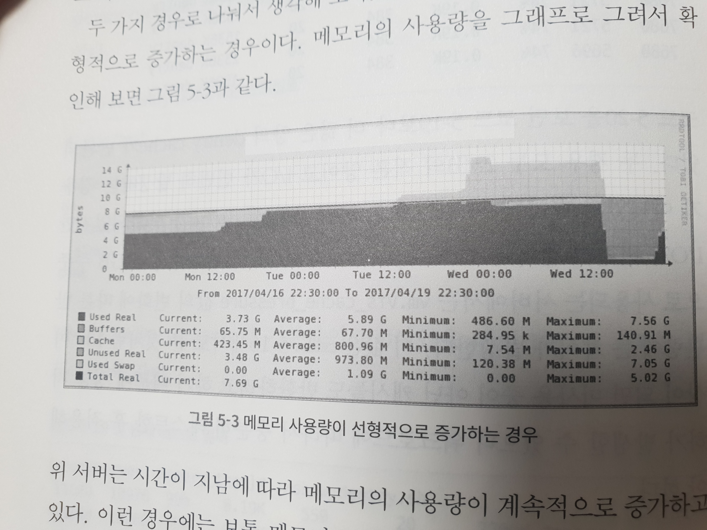
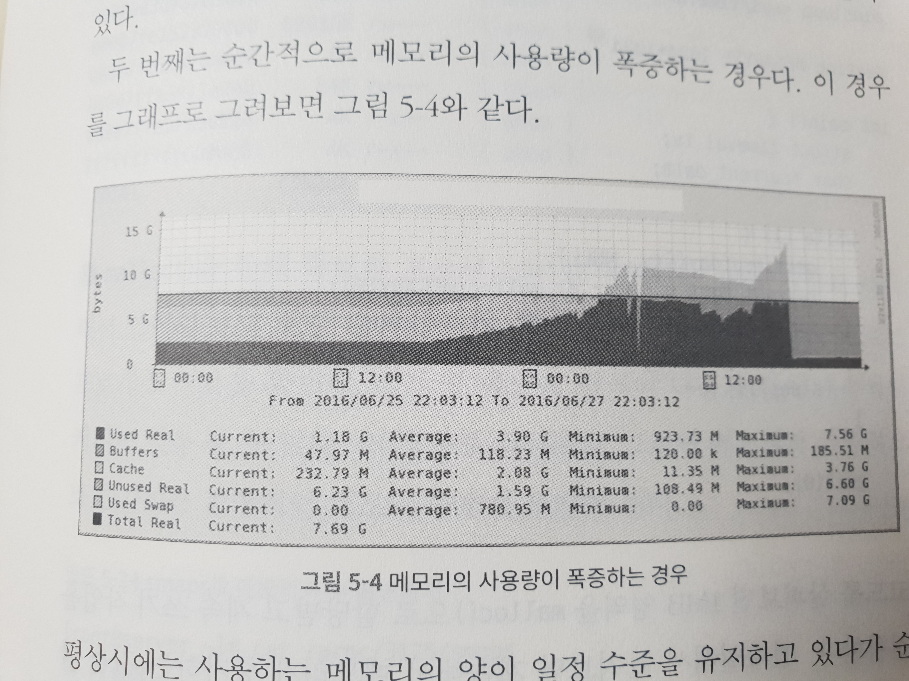

# 5장 swap, 메모리 증설의 포인트

이번 장에서는 메모리가 부족한 것을 어떻게 확인할 수 있는지, 그런 경우에 커널이 어떻게 대처하는지 알아보자.

## 5.1 swap 영역

swap 영역은 물리 메모리가 부족할 경우를 대비해서 만들어 놓은 영역이다.

- 디스크의 일부분을 메모리에 상주한 프로세스를 적재하기 위해 할당한다.
- 이를 사용하게 되는 경우에는 처리 속도가 현저히 떨어진다.

```sh
# free
              total        used        free      shared  buff/cache   available
Mem:        2046976      113592      613592         860     1319792     1760560
Swap:       1048572(1)     0(2)     1048572(3)
```

1. 전체 swap 영역의 크기(약 10GB 정도를 확보한 것을 볼 수 있다)
2. 현재 사용 중인 swap 영역의 크기
	- 조금이라도 있으면 메모리에 문제가 있다는 것을 의미하는 것일 수 있다.
3. 남아있는 swap영역의 크기

### 프로세스 swap

swap이 시스템에 있는걸 발견한 이후에는 swap을 발생시키는 프로세스를 알아내 죽여야 할 수도 있다.

모든 프로세스는 /proc/${pid} 의 디렉터리에 자신과 관련된 정보들을 저장한다.

- `/proc/${pid}/smaps` 파일이 메모리 정보를 저장하고 있다.

```
# cat /proc/1/smaps | more
...
7f4556b45000-7f4556b50000 r-xp 00000000 00:68 52
/lib/x86_64-linux-gnu/libnss_files-2.23.so
Size:                  4 kB
Rss:                   4 kB
Pss:                   2 kB
Shared_Clean:          0 kB
Shared_Dirty:          4 kB
Private_Clean:         0 kB
Private_Dirty:         0 kB
Referenced:            4 kB
Anonymous:             4 kB
AnonHugePages:         0 kB
ShmemPmdMapped:        0 kB
Shared_Hugetlb:        0 kB
Private_Hugetlb:       0 kB
Swap:                  0 kB (1)
SwapPss:               0 kB
KernelPageSize:        4 kB
MMUPageSize:           4 kB
Locked:                0 kBVmFlags: rd mr mw me dw ac
006f4000-006fd000 rw-p 000f4000 00:68 28
/bin/bash
Size:                 36 kB
Rss:                  36 kB
Pss:                  36 kB
Shared_Clean:          0 kB
Shared_Dirty:          0 kB
Private_Clean:         0 kB
Private_Dirty:        36 kB
Referenced:           36 kB
Anonymous:            36 kB
AnonHugePages:         0 kB
ShmemPmdMapped:        0 kB
Shared_Hugetlb:        0 kB
Private_Hugetlb:       0 kB
Swap:                  0 kB <---
SwapPss:               0 kB
KernelPageSize:        4 kB
MMUPageSize:           4 kB
Locked:                0 kB
VmFlags: rd wr mr mw me dw ac
006fd000-00703000 rw-p 00000000 00:00 0
Size:                 24 kB
...
```

그런데 smaps는 논리적 메모리 영역 별로 swap이 있는지 봐야 하기 때문에 불편하낟.

전체 swap 영역에 대한 정보가 필요할 때에는 status 파일을 통해 확인한다.

(1) VmSwap 항목이 해당 프로세스가 사용하는 swap 영역에 대한 정보를 의미한다.

```
# cat /proc/1/status
Name:	bash
Umask:	0022
State:	S (sleeping)
Tgid:	1
Ngid:	0
Pid:	1
PPid:	0
TracerPid:	0
Uid:	0	0	0	0
Gid:	0	0	0	0
...
mPTE:	      56 kB
VmPMD:	      12 kB
VmSwap:	       0 kB   (1)
HugetlbPages:	       0 kB
Threads:	1
SigQ:	0/7863
SigPnd:	0000000000000000
ShdPnd:	0000000000000000
SigBlk:	0000000000010000
...
```

전체 프로세스 별로 사용 중인 swap 영역의 크기를 확인하고 싶은 경우가 있는데, 이때는 smem이라는 유틸리티를 사용한다.

```
# smem -t
  PID User     Command                         Swap      USS      PSS      RSS
 2149 root     tmux                               0      260     1016     3040
    1 root     bash                               0      480     1082     3184
 2163 root     -bash                              0      516     1113     3232
 2152 root     -bash                              0      516     1121     3280
 2151 root     tmux                               0      704     1464     3496
 2515 root     /usr/bin/python /usr/bin/sm        0     5132     6411     8768
 2482 root     python run.py                      0     6080     7340     9668
-------------------------------------------------------------------------------
    7 1                                           0    13688    19547    34668

```

## 5.2 버디 시스템


커널은 버디 시스템을 통해 프로세스에 메모리를 할당한다.

- 버디 시스템은 물리 메모리를 연속된 메모리 영역으로 관리
- 단편화도 막고 요청에 빠르게 응답한다.

버디 시스템의 상황은 buddyinfo로 볼 수 있다.

- 각각의 행은 2의 배수이며 각각 연속 1개, 2개, 4개 영역을 의미한다.
- DMA 절의 메모리 가용량을 보면 `4kb * 2 + 8kb * 2 + 16kb + 32kb * 2 .... = 9704kb` 이렇게 된다.

```
# cat /proc/buddyinfo
Node 0, zone      DMA      2      2      1      2      2      2      2      1      2      1      1
Node 0, zone    DMA32    485    341    398    268    151     83     60     43     18     13     11
```

4MB를 malloc하는 코드를 실행시키고 다시 보면 4KB 버디가 줄어든 것을 확인 할 수 있다.

```
# cat /proc/buddyinfo
Node 0, zone      DMA      2      2      1      2      2      2      2      1      2      1      1
Node 0, zone    DMA32    485    341    398    268    151     83     60     43     18     13     10 <--
```

> 솔직히 난 안된다.. 왜그러지... ㅠㅠㅠ 아마도 버디를 안쓰는거 같은데..


## 5.3 메모리 재할당 과정

1. 메모리 할당 요청이 왔는데 메모리가 부족하다.
2. 캐시 메모리 영역을 비우고 재할당을 시도한다
	- 이 과정은 성능 저하에 큰 영향을 주지 않는다.
	- page cache, buffer cache, inode cache, dentry cache 등
3. 캐시를 비워도 모자라면 swap을 사용해 재할당한다
	- 프로세스가 사용하는 메모리 중 inactive 리스트에 있는 메모리를 골라 swap 영역으로 이동시킨다.
	- 이후 해당 메모리 영역을 해제하고 다른 프로세스에 할당한다.
	- 만약 swap에 이동시킨 메모리 영역을 프로세스가 참조하려고 하면 다시 디스크에서 불러와야 한다.
	- 이때 디스크 I/O가 일어나기 때문에 성능이 저하된다.

## 5.4 vm.swappiness와 vm.vfs_cache_pressure

### vm.swappiness

커널이 얼마나 공격적으로 메모리 영역을 swap 영역으로 옮기느냐를 결정하는 파라미터

- 기본값은 60으로 정의
- 이 값이 커지면 캐시를 비우지 않고 swap 영역으로 옮기는 작업을 더 빨리 진행한다.
- swap 영역으로 옮기면 프로세스가 사용할 때에 접근 시간이 늘어나지만
	- 자주 사용하지 않는 프로세스의 메모리는 swap 영역으로 가는 것이 나을 수도 있음
	- 페이지 캐시는 I/O 작업 시 디스크로의 접근을 줄여주기 때문에 전체적인 응답속도 향상이 일어난다.

### vm.vfs_cahe_pressure

캐시를 재할당한다고 결정되었을 때 PageCache를 더 많이 재할당할지 디렉터리나 inode 캐시를 더 많이 재할당할지를 결정

- 기본값은 100
- 미사용 중인 캐시 수 * vfs_cache_pressure / 100
- 높아질 수록 디렉터리/inode 캐시를 더 많이 재할당하게 된다.
- 100보다 높아질 경우 사용 중인 캐시도 반환하기 때문에 성능 저하가 발생할 수 있다.

## 5.5 메모리 증설의 포인트

swap 영역을 사용하는 것은 결국 현재의 메모리가 워크로드를 수용하기에는 부족하다는 것을 의미한다.

이때는 메모리의 사용량 추이를 살펴본 후 2가지로 나눠서 문제를 해결해야 한다.

### 선형적으로 늘어나는 경우



메모리 누수가 발생했을 수 있다.

- 어플리케이션이 요청을 처리하고 메모리를 제대로 해제하지 않았을 수 있다.
- pmap 등의 명령을 이용해서 해당 프로세스가 사용하는 힙 메모리 영역의 변화를 살펴볼 필요가 있다.
- gdb와 같은 도구를 이용해 늘어나는 힙 메모리에 메모리 덤프를 생성해서 확인할 수 있다.

### 폭증



평상시에는 일정 수준을 유지하고 있다가 순간적으로 요청이 폭주해서 swap을 사용하는 경우

- 증설하면 도움은 되지만 크게 문제되지 않는다면 swap을 사용하는 것도 하나의 방법


