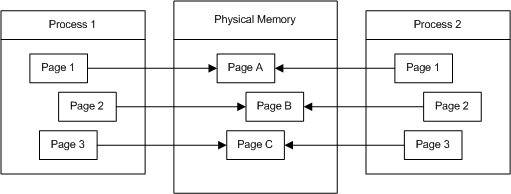
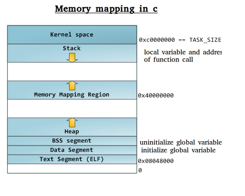

# Chapter 9 메모리 관리

## Overview

메모리는 프로세스에서 사용할 수 있는 리소스 중에서 가장 기본적이면서 핵심적인 리소스이다

이 장에서는 메모리 할당과 조작, 해제에 대해 알아본다

## 9.1 프로세스 주소 공간

리눅스는 물리적인 리소스인 메모리를 가상화한다.

- 커널이 개별 프로세스에 독자적인 가상 주소 공간을 제공한다.
- 이 가상 주소 공간은 0부터 시작해서 늘어난다.


## 9.1.1 페이지와 페이징

페이지는 메모리 관리 유닛(`MMU`)에서 관리할 수 있는 **최소 단위**이며 메모리 관리 측면에서 가장 중요한 단위이다.

- 페이지 -> 워드 -> 바이트 -> 비트 로 구성된다.
- 32비트 시스템
  - 페이지 크기: 4KB
  - 최대 페이지 개수: 100만개
- 64비트 시스템 
  - 페이지 크기: 8KB
  - 최대 페이지 개수: 수십억개


페이지에는 유효한 페이지와 유효하지 못한 페이지가 있다.

- 유효한 페이지: 실제 페이지(RAM 또는 Swap 파티션이나 디스크에 저장된 파일과 같은 2차 저장장치)에 연관되는 경우
- 유효하지 못한 페이지: 실제 물리 메모리와 연관되지 않은, 사용되지 않는 주소 -> 접근하면 세그멘테이션 폴트

2차 저장장치와 연결된 유효한 페이지인 경우에는 실제 메모리에 올리기 전에는 프로세스에서 접근할 수 없다.

- 프로세스에서 접근하려고 하면/ MMU는 페이지 폴트를 발생시킨다
- 그러면 커널은 2차 저장장치에 있는 데이터를 RAM으로 페이징한다
  - 공간이 부족할 경우 RAM은 우선순위가 낮은 데이터를 페이징 아웃한다.


## 공유와 copy-on-write

여러 프로세스는 동일한 물리 메모리를 서로의 다른 가상 메모리에서 공유할 수 있다.

- 표준 C 라이브러리를 사용할 때 각자의 가상 주소 공간으로 매핑하지만 실제 메모리에는 1개만 올라와 있다.
- 두 프로세스가 하나의 큰 데이터베이스를 맵핑하는 경우도 마찬가지



공유 데이터에 수정이 가해지는 경우에는 데이터를 복사하고 가상 메모리의 매핑을 복사한 데이터를 향하게 한다.

1. 쓰기 요청이 발생하고 MMU가 예외 발생
2. 커널이 쓰기를 요청한 프로세스를 위해 그 페이지의 복사본을 새로 만듦
3. 프로세스는 새로 만들어진 페이지에 쓰기 요청을 진행


이런 방식을 `copy-on-write(COW)`라고 한다.(COW는 페이지 단위로 발생한다.)

## 9.1.2 메모리 영역

커널은 접근 권한과 같은 특정 속성을 공유하는 **맵핑, 메모리 영역**에 페이지를 배열한다.

1. **텍스트 세그먼트**
    - 프로세스의 프로그램 코드, 문자열 상수, 상수 변수, 읽기 전용 데이터로 구성
    - 읽기 전용이며 실행 파일이나 라이브러리 오브젝트 파일에서 직접 맵핑
2. **스택 영역**
    - 프로세스의 실행 스택으로 구성
    - 스택 깊이가 깊어지고 얕아짐에 따라 동적으로 크기가 바뀐다. 
    - 실행 스택에는 지역 변수와 함수의 반환 데이터로 구성된다.
    - 멀티스레드 프로세스에서는 스레드 당 하나의 스택이 존재
3. **힙**
    - 프로세스의 동적 메모리로 구성
    - 쓰기 및 크기 변경이 가능
    - malloc은 이 영역에 메모리를 할당
4. **bss 세그먼트**
    - 초기화되지 않은 전역 변수를 담는다
    - 이 변수들은 C 표준에 따라(기본적으로는 0) 특수한 값을 담는다




리눅스에서는 두 단계로 변수를 최적화한다.

1. 초기화하지 않은 데이터는 bss 세그먼트에 할당된다.
    - 그러면 링커(ld)는 오브젝트 파일에 특수 값을 저장하지 않을 수 있어 바이너리의 크기가 줄어든다.
2. 이 세그먼트가 메모리에 적재되면 커널은 이 세그먼트를 copy-on-write 기법을 통해 0으로 채워진 페이지에 맵핑
    - 변수에 기본값인 0이 들어가게 된다.(효율적)


## 9.2 동적 메모리 할당하기

메모리 관리 시스템의 기본은 동적 메모리의 할당/사용/해제 이다.

- 동적 메모리는 컴파일 시점이 아니라 실행 중에 할당되며 크기를 미리 알 수 없다.
- e.g., 파일 크기를 알 수 없고, 사용자가 얼마나 많은 키를 입력할지도 모르기에 다양한 버퍼가 필요할 수 있기 때문

> 자동 변수나 정적 변수의 형태로 쓰이기는 하지만 이는 변동이 적다.

**malloc()** 은 동적 메모리를 얻는 대표적인 인터페이스이다.

```cpp
#include <stdlib.h>

// size 바이트만큼 메모리를 할당해서 새롭게 할당된 메모리 영역의
// 시작점을 가리키는 포인터를 반환.
// 이 메모리의 내용은 정의되지 않은 상태이다(0이라는 보장도 없다)
// 호출이 실패하면 NULL을 반환한다.
void * malloc(size_t size);
```

```cpp
// c에서는 별도로 casting하지 않아도 변환된다.
// 명시하지 않는 것이 c에서는 Good Pattern
char *p = malloc(2048);
struct treasure_map *map = malloc(sizeof (struct treasure_map));

if (!p)
    perror ("malloc");

// 하지만 cpp에서는 타입변환을 명시적으로 해주어야 한다.
char *p = (char*) malloc(2048);
```

관례적으로 malloc을 부르고 실패시 프로그램을 종료하는 함수를 정의하곤 한다.

```cpp
void * xmalloc (size_t size) {
    void *p;
    p = malloc (size);
    if (!p) {
        perror ("xmalloc");
        exit (EXIT_FAILURE);
    }
    return p;
}
```

## 9.2.1 배열 할당하기

배열에 들어가는 항목의 크기는 고정되어 있지만 배열의 길이가 고정되지 않은 경우에 활용할 수 있는 **calloc()** 함수를 제공한다.

- 할당된 메모리의 내용을 초기화하지 않는 malloc과 달리 calloc은 메모리 영역을 0으로 채워준다.
- `malloc(nr * size) + 0으로 초기화 == calloc(nr, size)` 

```cpp
#include <stdlib.h>

// 각각 크기가 size 바이트인 원소를 nr개 담을 수 있는 메로리 블록에 대한 포인트 반환
void * calloc(size_t nr, size_t size);
```

만약 malloc을 0으로 초기화하도록 사용하고 싶다면 아래처럼 구현해서 쓰면 된다.

```cpp
void * malloc0 (size_t size) {
    return calloc(1, size);
}

void * xmalloc0 (size_t size) {
    void *p;
    p = calloc(1, size);
    if (!p) {
        perror("xmalloc0");
        exit (EXIT_FAILURE);
    }
    return p;
}
```

## 9.2.2 할당 크기 변경

C 언어는 이미 할당된 영역을 키우거나 줄일 수 있는 변경 인터페이스를 제공한다.

```cpp
#include <stdlib.h>

// ptr이 가리키는 메모리 영역을 size 바이트로 새로 조정한다.
// 새로운 크기의 메모리를 반환하며 이전과 동일한 ptr이 아닐 수도 있다.
// 기존 메모리를 확장할 수 있다면 확장하고
// 그럴수 없다면 새로운 영역으로 복사한 다음 이전 영역을 해제한다.
void * realloc (void *ptr, size_t size);
```

복사할 상황이 있기 때문에 realloc은 상대적으로 비용이 많이 든다.

- `realloc(ptr, 0) == free(ptr)`
- `realloc(NULL, 4) == malloc(4)`

메모리 영역을 줄이는 예제를 살펴보자.

```cpp
// map 2개를 할당 받고
struct map *p = calloc(2, sizeof (struct map));
// 1개로 줄인다.
struct map *r = realloc(p, sizeof (struct map));
free(r)
```

## 9.2.3 동적 메모리 해제

동적 할당은 수동으로 해제될 때까지 프로세스 주소 공간에 계속 남아 있다. 따라서 프로그래머는 동적으로 할당된 메모리를 시스템에 반환해야 할 의무가 있다.

> 스택을 거슬러 올라오면서 자동으로 거둬들이는 자동 할당과 다르다.

```cpp
#include <stdlib.h>

// ptr이 가리키는 메모리를 해제한다.
// ptr은 malloc, calloc, realloc이 반환한 값이여야 한다.
// 중간값이면 시스템 그래시 발생
void free (void *ptr);
```

free(NULL)은 조용히 반환되기 때문에 아래 조건문은 불필요하다.

```cpp
if (ptr != NULL) free(ptr);
```

간단한 예제를 보자. 이 예제는 `print_chars(5, 'X')` 이면 아래 문구를 출력한다.

```
X
XX
XXX
XXXX
XXXXX
```

```cpp
void print_chars (int n, char c)
{
    int i;
    for(i = 0; i < n; i++) {
        char *s;
        int j;
        // i+2 크기의 char 배열을 할당하고 0으로 초기화
        s = calloc(i + 2, 1);
        for (j = 0; j < i + 1; j++){
            s[j] = c;
        }
        printf("%s\n", s);

        // 메모리 반환
        free(s)
    }
}
```

만약 free를 하지 않는다면 포인터 s도 잃어버려 접근도 하지 못하게 된다. 이런 경우를 메모리 릭이라 한다.

또, 메모리를 해제한 이후에 접근하는 경우가 있을 수 있는데, 시스템 에러가 발생하게 된다.

## 9.2.4 정렬

메모리 정렬은 메모리에 데이터를 나열하는 방식을 의미한다. 

- 메모리 주소 A가 n바이트에 정렬되었다고 할 때, n은 2의 거듭제곱이고, A는 n의 배수이다.

변수가 자신의 크기의 배수가 되는 메모리 주소에 저장되면 이를 자연스럽게 정렬된 상태라고 한다.

- 4 바이트 크기의 변수는 4의 배수인 메모리 주소에 위치할 경우 자연스럽게 정렬된 상태이다.
- 즉 주소 값의 최하위 두 비트가 0인 경우이다.
- 따라서 크기가 2^n 바이트인 타입은 주소에서 최하위 n비트가 0이 되어야 한다.


## 정렬된 메모리 할당하기

POSIX는 malloc, calloc, realloc에서 반환된 메모리가 어떤 표준 C 타입을 사용하든지 적절히 정렬되어야 한다고 정의한다.

- 32비트 시스템에서는 항상 8바이트로 정렬
- 64비트 시스템에서는 16바이트로 정렬

프로그래머가 페이지 같은 큰 단위로 정렬된 동적 메모리가 필요할 경우에 `posix_memalign()`이라는 함수를 사용하면 된다.

- 직접 블록 입출력이나 소프트웨어와 하드웨어 간의 통신을 위한 버퍼를 적절히 정렬해야 하는 경우
- 즉 malloc이 제공하는 정렬 단위보다 더 큰 정렬이 필요한 경우 사용

```cpp
#define _XOPEN_SOURCE 600
#define _GNU_SOURCE

#include <stdlib.h>

// 동적 메모리를 size 바이트만큼 할당하고 alignment의 배수인 메모리 주소에 맞게 정렬
// alignment는 2의 거듭제곱이며, void 포인터 크기의 배수여야 한다.
// 할당된 메모리 주소는 memptr에 저장된다.
int posix_memalign(void **memptr, size_t alignment, size_t size);
```

```cpp
char *buf;

// 256바이트에 맞춰 정렬되는 1KB를 할당
int ret = posix_memalign(&buf, 256, 1024);

// 사용하고

free(buf);
```

## 다른 정렬 고려 사항

비표준이나 복잡한 타입에는 표준 타입보다 더 복잡한 요구사항이 존재한다.


1. 구조체의 정렬 요구사항은 가장 큰 멤버의 타입을 따른다.
    - 가장 큰 타입이 32비트 정수이고 4바이트 단위로 정렬된다면
    - 이 구조체 역시 4바이트 단위로 정렬된다.
2. Union의 정렬 요구사항도 가장 큰 타입을 따른다.
3. 구조체는 각 멤버가 그 타입의 요사항에 맞게 정렬될 수 있도록 패딩을 넣는다
    - 
    - 구조체 멤버를 오름차순으로 조정하면 패딩에 소모되는 공간이 최소화될 수 있다.
4. 배열의 정렬 요구사항은 기본 타입을 따른다.

## 9.3 데이터 세그먼트 관리하기

> 크게 중요해보지 않음

유닉스 시스템은 전통적으로 데이터 세그먼트를 직접 관리할 수 있는 인터페이스를 제공한다.

- 일반적으로는 malloc이 더 편하고 강력해서 안쓴다.
- 힙 기반 할당 메커니즘을 너무나도 구현하고 싶다면 참고

```cpp
#include <unistd.h>

// end로 breakpoint 이동
int brk (void *end);
// breakpoint를 increment만큼 이동하고 주소를 반환
int * sbrk (intptr_t increment);

printf("The current break point is %p\n", sbrk(0));
```


## 9.4 익명 메모리 맵핑

리눅스에서는 일반적으로 [buddy 메모리 할당 기법](https://ko.wikipedia.org/wiki/%EB%B2%84%EB%94%94_%EB%A9%94%EB%AA%A8%EB%A6%AC_%ED%95%A0%EB%8B%B9)을 사용한다.

이 기법은 빠르고 정렬을 잘해주는 장점이 있지만 파편화(내부/외부)가 발생하기 쉽다는 단점이 있다.

- 내부 파편화는 요청에 필요한 것보다 많이 반환해야 해 발생
- 외부 파편화는 요청을 충족시킬만한 메모리가 나눠져 있어 사용할 수 없을 경우 발생

또한 큰 라이브러리 3개를 할당받았을 때, 힙에 저장하면

A - B - C로 처음에 할당받았을때 B가 해제되도 heap을 해제할 수 없다는 문제도 있다.

이러한 문제를 해결하기 위해 큰 메모리 할당에서는 익명 메모리 맵핑을 사용해 메모리 할당 요청에 대응한다.


## 9.4.1 익명 메모리 맵핑 생성하기

## 9.4.2 /dev/zero 맵핑하기

## 9.5 고급 메모리 할당

## 9.5.1 malloc_usable_size()와 malloc_trim()으로 튜닝하기

## 9.6 메모리 할당 디버깅

## 9.6.1 통계 수집하기
