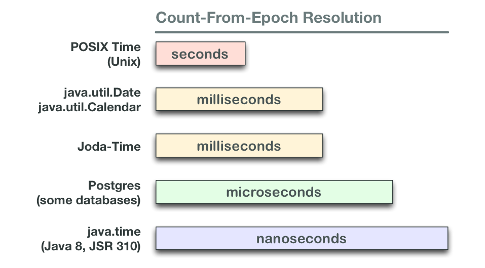
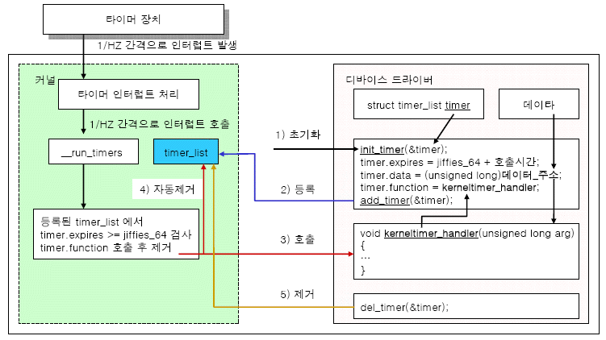

# Chapter 11 시간

## 11.0 Overview - 시간의 종류

최신 운영체제에서는 다양한 목적으로 시간을 사용하며 시간의 종류에는 아래 3가지가 있다.

1. 실제 시간
    - 현실에서 사용하는 진짜 시간과 날짜
    - 벽에 걸려있는 시계에서 읽은 시간
    - 변경 가능
    - 사용자와 상호작용하거나 타임스탬프를 붙일 때 사용
2. 프로세스 시간
    - 프로세서에서 프로세스를 실행하는데 소비한 시간
    - 프로세스가 사용자 영역에서 직접 소비했거나, 프로세스를 대신해 커널이 간접으로 소비한 시스템 시간을 측정하는데 사용
    - 실제 시간으로 이것을 처리하지 못하는 이유는 특정 연산을 수행하는 프로세스 시간이 실제 시간보다 무척 짧기 때문이다.
3. 모노토닉 시간
    - 이 시간은 반드시 일정하게 증가
    - 시동 직후부터 경과한 시간인 시스템 가동시간(uptime)을 사용
    - 시스템 가동시간은 결정론적이며 변경이 불가능한 시간 표현법
    - 두 샘플링 사이의 시간 차이를 계산할 때 유용

## 11.0 Overview - 시간의 표현

시간 측정 방법은 다음 두 형식 중 하나로 표현이 가능하다.

1. 상대 시간
    - 현재 시각, 5초 후, 10분 전 등
    - 모노토닉 시간은 상대 시간을 계산하는데 유용하다
    - 사용 예시
        1. 500밀리 초 이내 요청을 취소하거나
        2. 화면을 초당 60번씩 갱신
2. 절대 시간
    - 특정 기준점 없이 절대값으로 표현
    - 1968년 3월 25일 정호 같은 표현
    - 사용 예시
        1. 일정 관리 프로그램이 2월 8일 일정을 잡거나
        2. 파일 시스템이 파일 생성 날짜와 시각을 기록할 때

## 11.0 Overview - epoch

유닉스 시스템은 1970년 1월 1일 00:00:00 UTC로 정의된 기원(epoch)로부터 경과된 절대 시간을 초로 표현한다.

- 결국 절대 시간조차도 저수준에서는 상대 시간을 사용하고 있음을 의미한다.
- 이게 timestamp를 long으로 볼때 나오는 거인듯



## 11.0 Overview - jiffies counter

운영체제는 커널이 관리하는 소프트웨어 시계를 사용해 시간 경과를 추적한다.

- 시스템 타이머라고 알려진 주기적인 타이머를 초기화하고 정해진 주기에 맞춰 똑딱 거린다.
- 타이머 동작 주기가 한 차례 지나가면 커널은 경과 시간을 틱이나 지피라는 한 단위만큼 늘린다.
- 경과된 틱을 기록한 카운터를 지피 카운터라고 한다.(64bit)



리눅스에서는 시스템 타이머의 빈도를 `HZ`라고 한다.

- 100 -> 1000 -> 250으로 이 값은 바껴왔다
- 이 값에 의존해서 유저 프로그램을 작성해서는 안된다.
    - HZ:100 -> 지피 값:0.01
    - HZ:1000 -> 지피 값:0.001
    - HZ:250 -> 지피 값:0.004
- HZ가 높아지면 타이머 부하가 올라가는 이해 상충이 있다.

대다수 컴퓨터에는 하드웨어 시계가 내장되어 있어 컴퓨터가 꺼진 상태에서도 시간과 날짜를 저장한다.

- 커널은 시작하면서 하드웨어 시계에서 현재 시각을 받아 운영체제 시각을 초기화한다.
- 사용자가 시스템을 종료할 때 현재 시각을 하드웨어 시계에 다시 기록한다.
- 시스템 관리자는 hwclock 명령으로 이 두 시각을 동기화할 수 있다.

## 11.1 시간에 대한 자료구조

시간 관리를 위한 독자적인 인터페이스를 구현했으며 시간 개념을 여러 자료구조로 표현했다.

## 11.1.1 전통적인 표현법

```cpp
// epoch 이후에 경과한 초를 숫자료 표현
typedef long time_t;
```

2038년에 오버플로가 나기 때문에 그 이전에는 64비트로 전환되어야 한다.(되겠지?)

## 11.1.2 마이크로 초 정밀도

timeval 구조체는 time_t를 확장해서 ms 정밀도를 추가했다.

- time_t가 1초 단위라서 정밀도가 낮은 문제를 해결

```cpp
#include <sys/time.h>

struct timeval {
    time_t tv_sec; // 초
    suseconds_t tv_usec; // 마이크로 초
}
```

## 11.1.3 나노 초 정밀도

timespec은 나노초(us)까지 해상도를 높였다.

- 가장 선호되는 인터페이스
- 시간과 관련된 인터페이스는 timespec을 사용


```cpp
#include <time.h>

struct timespec {
    time_t tv_sec; // 초
    long tv_nsec; // 나노초
}
```

시스템 타이머가 나노초는 고사하고 마이크로 초 해상도도 지원하지 않기 때문에 지금은 명세된 정밀도가 제공되지는 않는다

> 언젠가 지원할거라고 생각한다.

## 11.1.4 시간 세분하기

사람에게 좀 더 가까운 형태로 세분화한 시간을 표현하는 구조체를 제공한다.

```cpp
#include <time.h>

struct tm {
    // 초 (0~59)
    int tm_sec; 
    // 분 (0~59)
    int tm_min; 
    // 시 (0~23)
    int tm_hour; 
    // 월중 경과일 (0~31, 0은 이전 달의 마지막 날짜)
    int tm_mday; 
    // 월 (1월 이후 경과한 월, 0~11)
    int tm_mon; 
    // 년 (1900 이후 경과한 년)
    int tm_year; 
    // 주중 경과일 (일요일부터 경과한 일, 0~6)
    int tm_wday; 
    // 연중 경과일 (1월 1일부터 경과한 일, 0~365)
    int tm_yday; 
    // 섬머타임 시간인가 (양수면, DST가 영향을 미침, 0이면 영향을 미치지 않음, 음수면 DST는 모름)
    int tm_isdst; 
#ifdef _BSD_SOURCE
    long tm_gmtoff; // GMT 시간대 오프셋
    const char *tm_zone; // 시간대 약어
#endif
}
```

> 저장 공간 낭비는 많지만 사용자 중심 값으로 변환하기에는 편리

## 11.1.5 프로세스 시간을 위한 타입

clock_t 틱은 시스템의 실제 타이머 주파스(GZ)나 CLOCKS_PPER_SEC을 나타낸다.

## 11.2 POSIX 시계

11장의 여러 시스템 콜은 시간 구현과 표현을 위한 표준인 POSIX 시계를 활용한다.

clockid_t 타입은 리눅스가 지원하는 다섯 가지 POSIX 시계를 나타낸다.

1. CLOCK_REALTIME
    - 시스템 전역에서 사용하는 실시간 시계
    - 이 시계를 설정하려면 특수 권한이 필요
2. CLOCK_MONOTONIC
    - 어떤 프로세스도 설정하지 못하는 단조롭게 증가하는 시계
    - 시스템 시동과 같이 불특정 시작 시점부터 경과한 시간을 나타냄
3. CLOCK_MONOTONIC_RAW
    - CLOCK_MONOTONIC과 유사하지만 시간이 뒤틀렸을 때 조정이 되지 않는다.
    - 즉 하드웨어 시계가 실제 시간보다 빨라지거나 늦어진다고 해도 조장이 되지 않는다.
    - 리눅스 전용
4. CLOCK_PROCESS_CPUTIME_ID
    - 프로세서 수준에서 지원되는 각 프로세스에서 사용 가능한 고해상도 시계다.
    - 이 시계는 Time Stamp Counter 레지스터를 사용
5. CLOCK_THREAD_CPUTIME_ID
    - 프로세스 스레드마다 유일한 시계

POSIX에서는 CLOCK_REALTIME 만 요구하기에 이식성을 높히려면 다른 시계를 사용하지 않는 것이 좋다.

## 11.2.1 시계 해상도

POSIX는 시계 해상도 정보를 제공하는 clock_getres() 함수를 정의한다.

```cpp
#include <time.h>

// 성공할 경우 해상도를 res에 저장
int clock_getres (clockid_t clock_id, struct timespec *res);
```

```cpp
clockid_t clocks[] = {
    CLOCK_REALTIME,
    CLOCK_MONOTONIC,
    CLOCK_PROCESS_CPUTIME_ID,
    CLOCK_THREAD_CPUTIME_ID,
    CLOCK_MONOTONIC_RAW,
    (clockid_t)-1 };

int i;

for(i = 0; clocks[i] != (clockid_t)-1; i++){
    struct timespec res;
    int ret = clock_getres(clocks[i], &res);
    printf("clock=%d sec=%ld nsec=%ld\n",
        clocks[i], res.tv_sec, res.tv_nsec);
}
```

```
# 64에서는 일케 나옴
clock=0 sec=0 nsec=1000
clock=6 sec=0 nsec=1000
clock=12 sec=0 nsec=1000
clock=16 sec=0 nsec=1
clock=4 sec=0 nsec=1

# x86에서는
# 400250나노 초 == 0.004초 --> HZ가 250인 x86 시스템 시계의 해상도와 일치
clock=0 sec=0 nsec=400250
clock=1 sec=0 nsec=400250
clock=2 sec=0 nsec=1
clock=3 sec=0 nsec=1
clock=4 sec=0 nsec=400250
```

## 11.3 현재 시간 얻기

현재 시각을 얻기 위해 가장 보편적으로 사용하는 함수는 time()이다.

```cpp
#include <time.h>

time_t time (time_t *t);
```

기원 시간 이후 경과한 현재 시각을 초 단위로 표현된 값을 전달한다.

```cpp
time_t t;
print("current time: %ld \n", (long) time (&t));
print("the same value: %ld\n", (long) t))
```

```
current time: 1524044292
the same value: 1524044292
```

> time_t는 실제로 기원 시간 이후 경과한 초를 정확하게 표현하지 못한다. 윤년은 4로 나눠지는 모든 해를 가정하고 있으며 윤초는 완전히 무시한다. time_t는 정확한 타입이라기 보다는 일관성이 있는 단위로 보는 것이 맞다.

## 11.3.1 더 나은 인터페이스

gettimeofday() 함수는 마이크로 초 해상도를 제공하는 time()의 확장 버전이다.

```cpp
#include <sys/time.h>

// 성공하면 tv에 현재 시각을 기록한다.
// timezone과 tz는 더이상 리눅스에서 사용하지 않기 때문에 NULL을 넘긴다
// 커널이 더이상 시간대를 관리하지 않기 때문에 사용하지 않는다
int gettimeofday (struct timeval *tv, struct timezone *tz);
```

```cpp
struct timeval tv;
int ret = gettimeofday (&tv, NULL);
printf("seconds=%ld useconds=%ld\n", (long)tv.tv_sec, (long) tv.tv_usec);
```

## 11.3.2 고급 인터페이스

POSIX에서는 지정한 시계의 시간을 얻기 위한 clock_gettime() 인터페이스를 제공한다.

이 함수는 나노 초 정밀도를 허용한다.

```cpp
#include <time.h>

int clock_gettime(clockid_t clock_id, struct timespec *ts);
```

```cpp
clockid_t clocks[] = {
    CLOCK_REALTIME,
    CLOCK_MONOTONIC,
    CLOCK_PROCESS_CPUTIME_ID,
    CLOCK_THREAD_CPUTIME_ID,
    CLOCK_MONOTONIC_RAW,
    (clockid_t)-1 };

int i;

for(i = 0; clocks[i] != (clockid_t)-1; i++){
    struct timespec ts;
    int ret = clock_gettime(clocks[i], &ts);
    printf("clock=%d sec=%ld nsec=%ld\n",
        clocks[i], ts.tv_sec, ts.tv_nsec);
}
```

```
lock=0 sec=1524139530 nsec=384565000
clock=6 sec=2329579 nsec=153400000
clock=12 sec=0 nsec=2659000
clock=16 sec=0 nsec=2665659
clock=4 sec=2329578 nsec=578640416
```

## 11.3.3 프로세스 시간 얻기

times() 시스템 콜은 실행 중인 프로세스와 자식 프로세스의 프로세스 시간을 틱 단위로 가져온다.

1. 사용자 시간은 사용자 영역에서 코드를 수행한 시간
2. 시스템 시간은 커널 영역에서 코드를 수행한 시간 (시스템 콜이나 페이지 폴트 등)

```cpp
#include<sys/times.h>

struct tms {
    clock_t tms_utime; // 소비한 사용자 시간
    clock_t tms_stime; // 소비한 시스템 시간
    clock_t tms_cutime; // 자식 프로세스가 소비한 사용자 시간
    clock_t tms_cstime; // 자식 프로세스가 소비한 시스템 시간
}

// buf에 프로세스와 그 자식을 수행하는 과정에서 소비한 프로세스 시간이 기록된다.
clock_t times (struct tms *buf);
```

자식 프로세스가 끝나고 부모가 waitpid() 관련 함수를 호출하고 나서 각 자식 프로세스에 대한 보고 시간이 구조체의 해당 필드에 포함된다.

> 절대값으로는 큰 의미가 없고 호출 사이에 일어난 상대적인 변화값을 보기 위해 주로 사용한다.

## 11.4 현재 날짜와 시각 설정하기

애플리케이션이 현재 날짜와 시간을 지정한 값으로 설정해야 할 때에 stime()을 사용할 수 있다.

> 이 함수는 time()과 대응된다

```cpp
#define _SVID_SOURCE
#include <time.h>

// CAP_SYS_TIME이 있어야 하고, 이는 일반적으로 root 사용자를 의미한다
int stime (time_t *t);
```

```
time_t t = 1;

// 시간을 기원 시간으로부터 1초 후로 설정한다.
int ret = stime (&t);
```

## 11.4.1 정확하게 시간 설정하기

gettimeofday()의 대응 함수는 settimeofday()이다.

```cpp
#include <sys/time.h>

// 마찬가지로 tz는 NULL을 권장한다.
int settimeofday (const struct timeval *tv, const struct timezone *tz);
```

```cpp
struct timeval tv = { .tv_sec = 1406441760,
    .tv_usec = 27182818 };
int ret = settimeofday(&tv, NULL);
```

## 11.4.2 시각 설정을 위한 고급 인터페이스

clock_gettime()의 대응 함수는 clock_settime()이다.

```cpp
#include <time.h>

// CLOCK_REALTIME만 설정 가능하다.
// 나노 초 해상도를 제공한다는 점에서 settimeofday()보다 낫다
int clock_settime(clockid_t clock_id, const struct timespec *ts);
```

## 11.5 시간 다루기

유닉스 시스템의 C 언어는 세분화된 시간과 time_t 사이를 변환하는 함수를 제공한다.

asctime()은 tm 구조체를 ASCII 문자열로 변환한다.

```cpp
#include <time.h>

// 정적으로 할당된 문자열을 가리키는 포인터를 반환한다.
// asctime()은 스레드 세이프하지 않기 때문에 asctime_r을 권장한다.
// buf는 최소한 문자 26글자를 담을 수 있는 크기여야 한다.
char * asctime (const struct tm *tm);
char * asctime_r (const struct tm *tm, char *buf);
```

mktime()은 tm 구조체를 time_t로 변환한다.

```cpp
#include <time.h>

time_t mktime (struct tm *tm);
```

ctime()은 time_t를 ASCII 표현으로 변환한다.

```cpp
#include <time.h>

char * ctime (const time_t *timep);
char * ctime_r (const time_t *timep, char *buf);
```

```cpp
time_t t = time (NULL);
printf ("the time a mere line ago: %s", ctime (&t));
// the time a mere line ago: Sat Apr 21 12:04:11 2018
```

gmtime()은 time_t를 tm 구조체로 변환하며 UTC 시간대로 표현한다.

```cpp
#include <time.h>

struct tm * gmtime (const time_t *timep);
struct tm * gmtime_r (const time_t *timep, struct tm *result);

struct tm {
  int tm_sec;   /* 초 */
  int tm_min;   /* 분 */
  int tm_hour;  /* 시 (0--23) */
  int tm_mday;  /* 일 (1--31) */
  int tm_mon;   /* 월 (0--11) */
  int tm_year;  /* 년 (+ 1900) */
  int tm_wday;  /* 요일 (0--6; 일요일 = 0) */
  int tm_yday;  /* 올해 몇번째 날 (0--365) */
  int tm_isdst; /* 서머타임 여부 */

};
```

localtime()은 gmtime()과 유사하지만 사용자 시간대에 맞춰서 표현해준다.

> gmtime()은 UTC에 맞춰서 표현

```cpp
#include <time.h>

struct tm * localtime (const time_t *timep);
struct tm * localtime_r (const time_t *timep, struct tm *result);
```

difftime()은 두 time_t 값 사이에 경과한 초를 double 타입으로 변환해서 반환한다.

```cpp
#include <time.h>

double difftime (time_t time1, time_t time0);

// (double) (time1 - time0)
```

## 11.6 시스템 시계 조율

실제 시간을 갑작스럽게 조정하면 시각에 의존하는 앱들은 혼란에 빠지게 된다.

그래서 유닉스는 adjtime() 함수를 통해 제공된 시간 차이에 따라 현재 시각을 점진적으로 조정한다.

> 지속적으로 시간을 보정하는 NTP(Network Time Protocol) 데몬 같은 백그라운드 작업은 시스템에 미치는 영향을 최소화하기 위해 adjtime()을 사용하여 주기적으로 시간을 보정한다.

```cpp
#define _BSD_SOURCE
#include <sys/time.h>

// 커널이 delta로 지정한 시간에 맞춰 천천히 조정 작업을 시작하도록 한 다음 0을 반환
// delta로 지정한 시간이 양수면 커널은 시계를 맞출 때까지 시스템 시계를 빨리 가게 만든다.
// delta로 지정한 시간이 음수면 커널은 시스템 시계를 느리게 가게 만든다.
// olddelta에는 진행중인 delta 값을 기록한다.
// adjtime()의 delta값은 적은 값이여야 한다. 
int adjtime (const struct timeval *delta, struct timeval *olddelta);
```

adjtimex()는 더 복잡한 시간 조정 알고리즘을 제공한다

```cpp
#include <sys/timex.h>

int adjtimex (sturct timex *adj);

// 자세한 설명은 생략
```

## 11.7 잠들기와 대기

특정 시간 동안 프로세스를 재우는 다양한 함수가 있는데, 첫 번째 함수는 sleep()이다.

```cpp
#include <unistd.h>

// sleep은 잠들지 않은 초를 반환한다.(따라서 성공하면 0을 반환한다.)
unsigned int sleep (unsigned int seconds);
```

```cpp
sleep(7); // 7초간 잠든다.
unsigned int s = 5;
while((s = sleep(s)));
```

## 11.7.1 마이크로 초 해상도로 잠들기

초 단위로 잠드는 기능만으로는 부족하기 때문에 마이크로 초 단위의 usleep()이 필요하다.

```cpp
#include <unistd.h>

// 실제로는 unsinged int가 아니지만 여러 기기간 호환성을 위해 이렇게 사용한다.
void usleep (unsigned int usec);
```

```cpp 
unsigned int usecs = 200;

usleep(usecs);
```

## 11.7.2 초 해상도로 잠들기

리눅스는 usleep() 보다는 nanosleep() 함수를 권장한다.

1. 더 높은 해상도를 제공
2. POSIX.1b에서 표준화되었다.
3. 시그널로 구현되어 있지 않음

```cpp
#define _POSIX_C_SOURCE 199309

#include <time.h>

// req로 명시한 시간동안 잠들고 0을 반환한다.
// rem이 NULL이 아닐 경우 남은 시간을 여기에 저장한다. 
int nanosleep (const struct timespec *req,
    struct timespec *rem);
```

```cpp
struct timespec req = {.tv_sec = 0,
    .tv_nsec = 200 };
// 200 나노 초동안 잠든다.
ret = nanosleep (*req, NULL);
```

## 11.7.3 고급 잠들기 기법

POSIX 시계는 고급 잠들기 인터페이스를 제공한다.

```cpp
#include <time.h>

int clock_nanosleep (clockid_t clock_id,
    int flags,
    const struct timespec *req,
    struct timespec *rem);
```

```
// nanosleep() 과 유사하게 동작한다.
ret = nanosleep(&rep, &rem);
ret = clock_nanosleep(CLOCK_REALTIME, 0, &req, &rem);
```

둘의 차이는 clock_id와 flags에 있다.

1. clock_id는 측정 대상 시계를 명시한다.
    - CLOCK_PROCESS_CPUTIME_ID 는 프로세스 수행이 멈출 때 멈추기 때문에 의미가 없다.(그래서 막혀있다)
    - 절대 시간으로는 CLOCK_REALTIME이 적합
    - 상대 시간으로는 CLOCK_MONOTONIC이 적합
2. flags
    - TIMER_ABSTIME 절대값으로 req를 취급
    - 0일 경우 상대값

```cpp
struct timespec ts = { .tv_sec = 1, .tv_nsec = 500000000 };
int ret = clock_nanosleep (CLOCK_MONOTONIC, 0, &ts, NULL);

struct timespec ts;
int ret = clock_gettime(CLOCK_MONOTONIC, &ts);

ts.tv_sec += 1;
ret = clock_nanosleep (CLOCK_MONOTONIC, TIMER_ABSTIME, &ts, NULL);
```

> 보통은 상대 시간으로 잠자기를 하지만, 매우 정확한 시간을 지정해서 절대 값으로 잠길기를 할 때도 있다.

## 11.7.4 이식성을 고려한 잠들기

```cpp
#include <sys/select.h>

int select(int nfds, fd_set *readfds, fd_set *writefds,
    fd_set *exceptfds, struct timeval *timeout);
```

```cpp
struct timeval tv = { .tv_sec = 0, .tv_usec = 757 };

// 757ms 만큼 잠든다.
// tv만큼이 지나면 timeout
select (0, NULL, NULL, NULL, &tv);
```

> 예전 유닉스 시스템과의 호환성이 문제가 되면 select를 사용하는 것이 최선

## 11.7.5 시간 초과

생략

## 11.7.6 잠들기 대안

되도록 잠들기는 피해야 한다. 파일 디스크립터를 블록해서 커널이 잠들기를 처리하고 프로세스를 깨우도록 허용하는 코드가 훨씬 좋다.

## 11.8 타이머

커널은 주어진 시간이 경과했을 때 프로세스에 알려주는 메커니즘을 제공한다.

- 타이머가 만료되기 전까지 경과한 전체 시간을 딜레이나 만료시간이라고 한다.
- 타이머가 만료됐을 때 커널이 프로세스에 통지하는 방법은 타이머에 따라 다르다.

> 타이머는 화면을 초당 60번씩 갱신하거나, 500 밀리 초 이후에도 계속 진행되는 미해결 트랜잭션을 취소할 때 등에 사용된다.

## 11.8.1 간단한 알람

alarm()은 가장 단순한 타이머 인터페이스이다.

```cpp
#include <unistd.h>

// seconds 초 경과 이후 프로세스에 SIGALRM 시그널 전송
// 이미 알람이 있는 경우 새로 요청한 알람으로 대체한다.
// seconds가 0이면 이전 알람은 취소하고 새로운 알람을 걸어두지 않는다.
unsigned int alarm (unsigned int seconds);
```

```cpp
void alarm_handler (int signun){
    printf("Five seconds passed \n");
}

void func (void){
    signal (SIGALRM, alrm_handler);
    alarm(5);
    pause();
}
```

## 11.8.2 인터벌 타이머

인터벌 타이머 시스템 콜은 POSIX에서 표준화되었으며 alarm() 보다 풍부한 제어 기능을 제공한다.

which

1. ITIMER_REAL: 실제 시간을 측정, 경과 시 SIGALRM 시그널 보냄
2. ITIMER_VIRTUAL: 사용자 영역 코드가 수행하는 동안에만 타이머가 흘려간다. SIGVTALRM 출력
3. ITIMER_PROF: 프로세스가 실행 중이거나 프로세스를 대신해서 실행 중인 경우 시간이 흘러간다. (보통 ITIMER_VIRTUAL과 함께 상요됨),  SIGVTALRM 출력
4. ITIMER_REAL: alarm과 같은 방식


```cpp
#include <sys/time.h>

int getitimer (int which,
    struct itimerval *value);

// which가 가리키는 타이머에 it_value로 지정한 만료 시간을 설정
// it_value로 지정한 시간이 경과한 다음에 it_interval로 지정한 시간으로 타이머 재설정
// it_value는 현재 타이머에 남아 있는 시간이다
// it_value가 0에 도달하면 it_interval로 it_value가 설정된다
int setitimer (int which,
    const struct itimerval *value,
    struct itimerval *ovalue);

struct itimerval {
    struct timeval it_interval; // 다음 값
    struct timeval it_value; // 현재 값
}

// timeval은 마이크로 초 해상도까지 지원
struct timeval {
    long tv_sec; // 초
    long tv_usec; // 마이크로초
}
```

```cpp
void alarm_handler (int signo) {
    printf("Timer hit!\n");
}

void foo (void) {
    struct itimerval delay;
    signal (SIGALRM, alarm_handler);
    delay.it_value.tv_sec = 5;
    delay.it_value.tv_usec = 0;
    delay.it_interval.tv_sec = 1;
    delay.it_interval.tv_usec = 0;
    int ret = setitimer (ITIMER_REAL, &delay, NULL);
    pause();
}
```

> nanosleep은 시그널을 사용하지 않기 때문에 잠깐 기다릴 목적이라면 setitimer나 alarm을 사용해야 한다.

## 11.8.3 고급 타이머

가장 강력한 타이머 인터페이스는 POSIX 시계에서 시작한다.

### 타이머 생성하기

```cpp
#include <signal.h>
#include <time.h>

int timer_create(clockid_t clockid,
    struct sigevent *evp,
    timer_t *timerid);
```

```cpp
timer_t timer;
int ret = timer_create (CLOCK_PROCESS_CPUTIME_ID, NULL, &timer);
```


