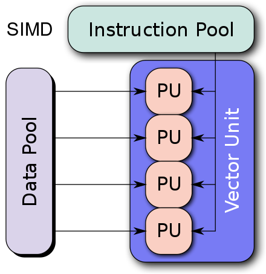
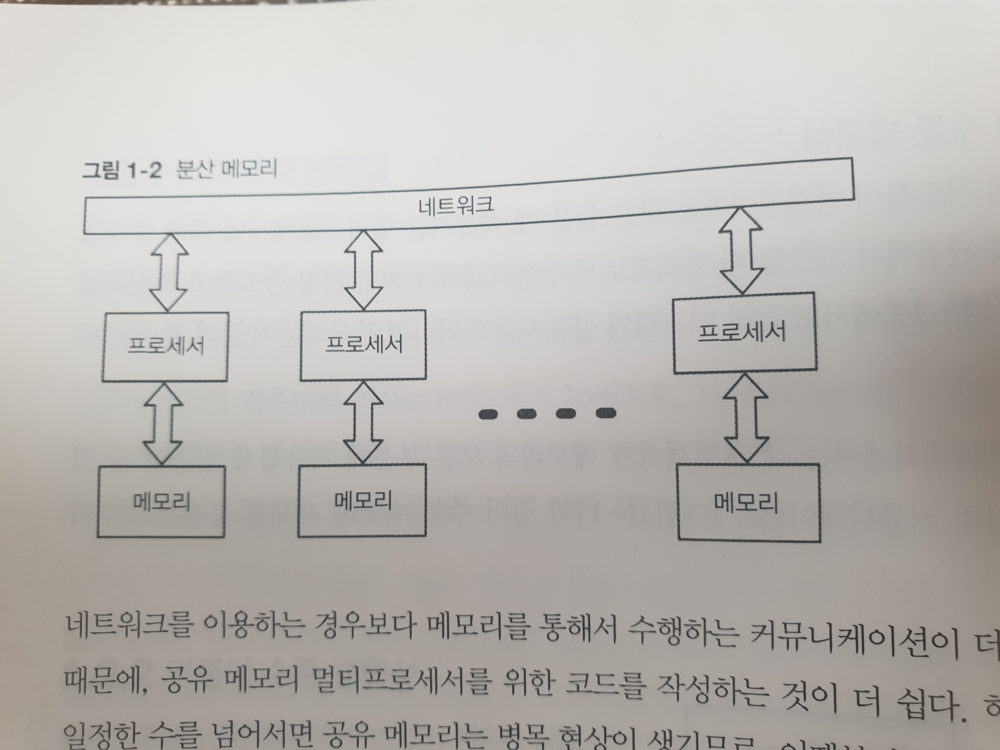

# Chapter 1. 서문

## Overview

동시성 프로그래밍은 최근 뜨거운 주제로 떠오르고 있다. 얼랭, 하스켈, 고, 스칼라, 클로저 같은 언어들이 탁월하게 지원하고 있다.

동시성에 대한 관심이 급증하는 가장 큰 이유로는 **멀티코어의 위기**가 자리잡고 있다.

- 하나의 CPU의 속도가 늘어나는 것에서 한계가 발생
- 코어 개수를 늘림
- 이런 여러개의 코어를 활용하지 못하면 성능 향상이 어렵다.

> 허브 셔터 "공짜 점심은 끝났다"
>
> 이제는 여러개의 코어, 병렬성을 활용해야 하는 시대다.

## 1.1 동시성 혹은 병렬성?

**동시성(concurrency)**과 **병렬성(Parallelism)**은 비슷한 의미로 사용되지만 서로 다른 개념이다.


## 1.1.1 비슷하지만 다른

동시적 프로그램

1. 여러 개의 논리적 통제 흐름(threads of control)을 갖는다
2. 논리적 흐름, 즉 Thread는 병렬로 실행될 수도 아닐 수도 있다.
3. 여러 작업을 한꺼번에(혹은 거의 한꺼번에) 처리해야 한다는 요구사항을 가짐

병렬적 프로그램

1. 계산에 필요한 부분을 한꺼번에 (병렬로) 실행함으로써 순차적 프로그램보다 빨리 동작할 가능성이 있다.
2. 프로그램에서 사용하는 논리적 통제 흐름은 하나 이상일 수 있다.
3. 프로그램 내의 각기 다른 부분을 병렬로 실행함으로써 해법 자체의 처리 속도를 더 빠르게 한다.

> 동시성은 여러 일을 한꺼번에 다루는 데 관한 것이다.
> 병렬성은 여러 일을 한꺼번에 실행하는 데 관한 것이다.

## 1.1.2 순차적 프로그래밍을 넘어서

동시성과 병렬성이 혼동되는 이유는 스레드와 잠금장치가 병렬성을 직접 지원하지 않기 때문이다.

- **스레드+락**으로 멀티코어를 활용하는 유일한 방법은 동시적인 프로그램을 작성해 병렬로 동작하는 하드웨어에서 실행하는 것
- 비결정적이기 때문에 이를 해결하기가 매우 어렵다.
    - 타이밍에 따라 결과가 달라진다.

동시적인 프로그램은 기본적으로 비결정적(nondeterministic)이고 이를 당연하게 받아들인다.
    
병렬성은 비결정성을 내포하지 않는다.

```
배열에 담겨 있는 모든 숫자에 2를 곱하는 동작은
배열의 절반은 한 코어에서 처리하고
나머지 절반은 다른 코어에서 처리한다는 이유로
결과가 달라지지 않는다.
```

명시적으로 병렬성을 지원하는 언어들은 비결정성이라는 유령을 두려워하지 않고 병렬 코드를 작성하는 방법을 제공한다.


## 1.2 병렬 아키텍처

현대 컴퓨터는 다수의 코어 뿐만 아니라 여러 수준에서 다양한 병렬성을 제공한다.

현대 컴퓨터는 비트와 명령어 등의 수준에서 병렬로 처리되는 추가적인 트랜지스터를 사용할 수 있게 해준다.

## 1.2.1 비트 수준 병렬성

32비트 컴퓨터가 8비트 컴퓨터보다 빠른 이유는 병렬성 때문이다.

1. 8비트 컴퓨터가 32비트 수를 더하고 싶으면 8비트 명령들의 수열을 생성해야 한다.
2. 이에 반해 32비트 컴퓨터는 한 번의 단계로 처리할 수 있다.

이러한 병렬성으로 얻을 수 있는 이점에는 일정한 한계가 있다.

> 128비트 계산이 자주 발생해야 ROI가 나오는 모양이다.

## 1.2.2 명령어 수준 병렬성

현대 CPU는 파이프라이닝, 비순차 실행(out-of-order execution), 추측 실행(speculative execution) 등의 기법을 이용하며 매우 병렬적이다.


보이지 않는 곳에서 프로세서가 이런 작업을 병렬로 처리하기 때문에 순서대로 동작하는 것 처럼 보인다. 

하지만 하나의 코어로는 더 이상 빨라지게 할 방법을 찾기가 어려워졌고, 여러 개의 코어가 협업하는 병렬성을 찾기 시작했다.

그래서 명령어들이 순서대로 동작하지 않는 상황을 걱정해야 한다.

## 1.2.3 데이터 수준 병렬성

데이터 병렬(SIMD Single instruction multiple data) 아키텍처는 대량의 데이터에 대해 똑같은 작업을 병렬적인 방식으로 수행하는 것을 가능하게 한다.



이미지 처리가 이런 데이터 병렬성에 적합하다.

> 이미지의 밝기를 환하게 조절할 때

현대의 GPU는 강력한 데이터 병렬 처리기로 진화했다.

## 1.2.4 태스크 수준 병렬성

대부분의 사람들이 병렬성이라는 말을 들을 때 떠올리는 멀티 프로세서에 대해 알아보자.

멀티 프로세서 아키텍처가 지닌 가장 중요하고 특정적인 부분은 메모리 모델이다.

- 그 중에서도 메모리가 공유되는지 분산되는지에 대한 부분이다.


**공유 메모리** 멀티프로세서에서는 각 프로세서가 메모리의 모든 부분에 자유롭게 접근할 수 있다. 

프로세스 사이의 커뮤니케이션은 주로 메모리를 통해 이루어진다.


**분산 메모리** 멀티프로세서에서는, 프로세서가 저마다의 메모리를 가지고, 프로세서 사이의 커뮤니케이션은 주로 네트워크를 통해 이루어진다.



메모리를 통해 커뮤니케이션을 하는 것이 더 빠르고 간단하기 때문에 공유 메모리 멀티 프로세서를 위한 코드를 작성하는 것이 더 쉽다.

하지만 프로세서가 일정한 수를 넘어서면 공유 메모리는 병목 현상이 생기므로, 이후부터는 분산 메모리가 더 빠르고 간편하다.

하드웨어 결함에 대비한 장애 허용(fault tolerant) 시스템을 구축할 때에도 분산 메모리는 불가피하다.

## 1.3 동시성:멀티코어를 넘어서

## 1.3.1 동시적인 세계에 맞는 동시적 소프트웨어

## 1.3.2 분산된 세계에 맞는 분산 소프트웨어

## 1.3.3 예측 불가능한 세계에 맞는 탄력적 소프트웨어

## 1.3.4 복잡한 세계에 맞는 단순한 소프트웨어

## 1.4 일곱가지 모델
