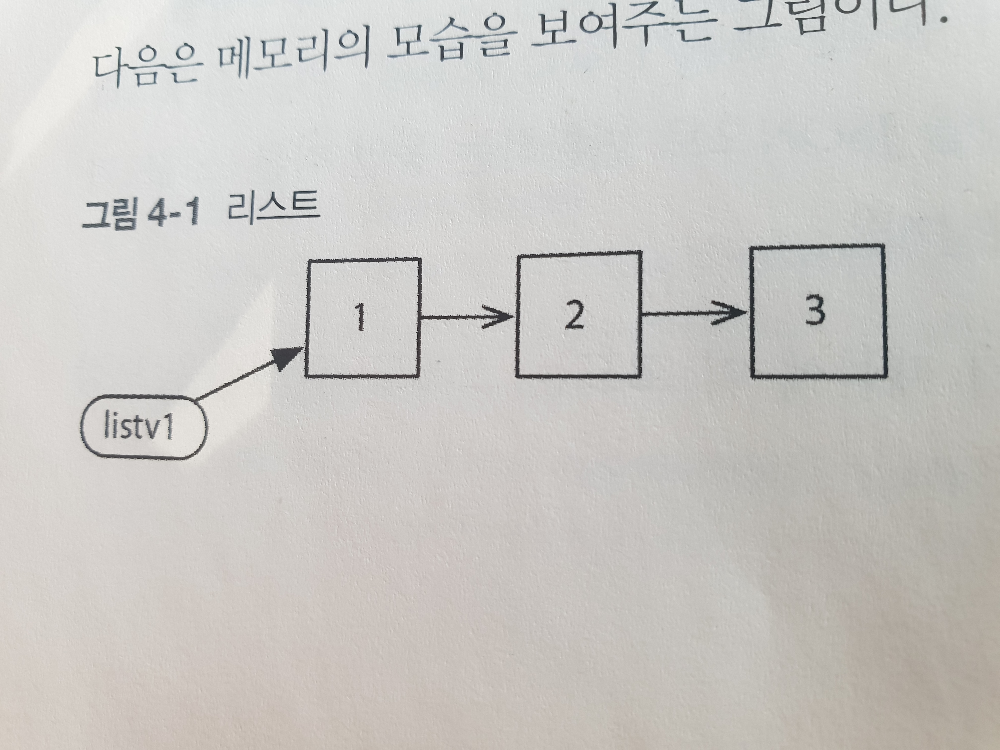
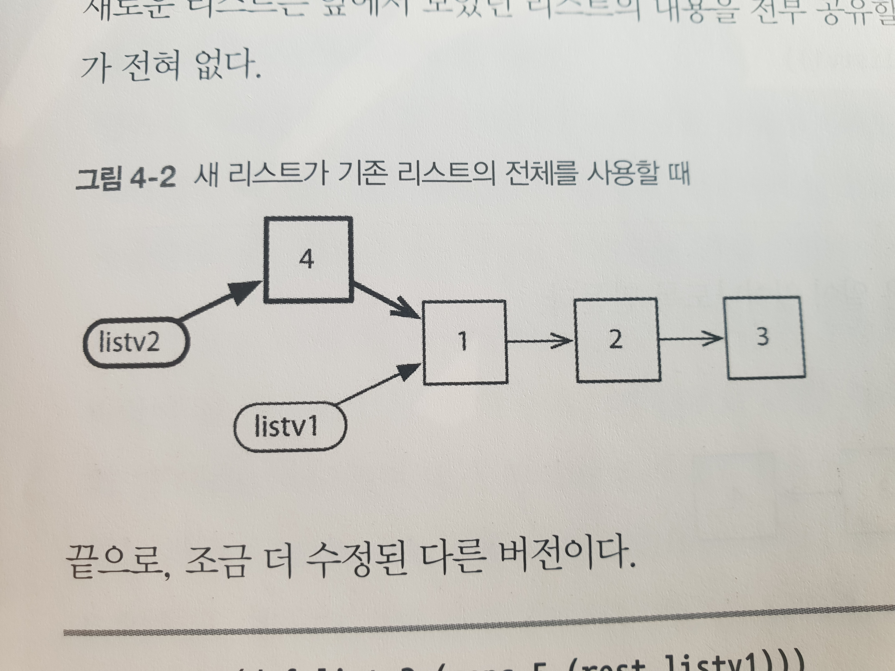
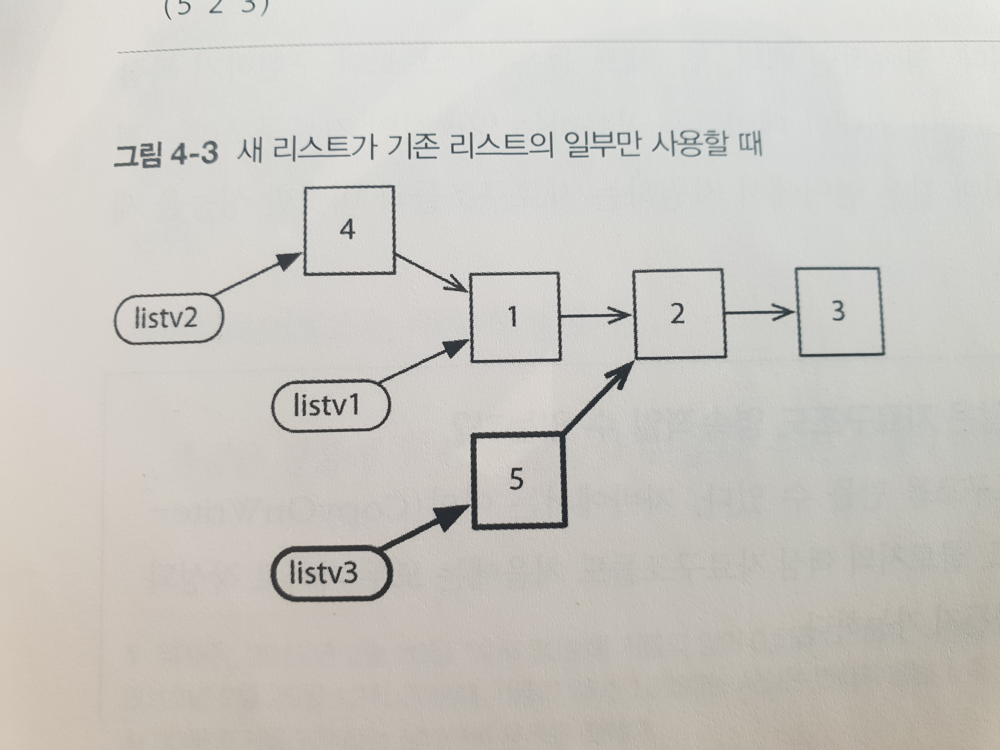
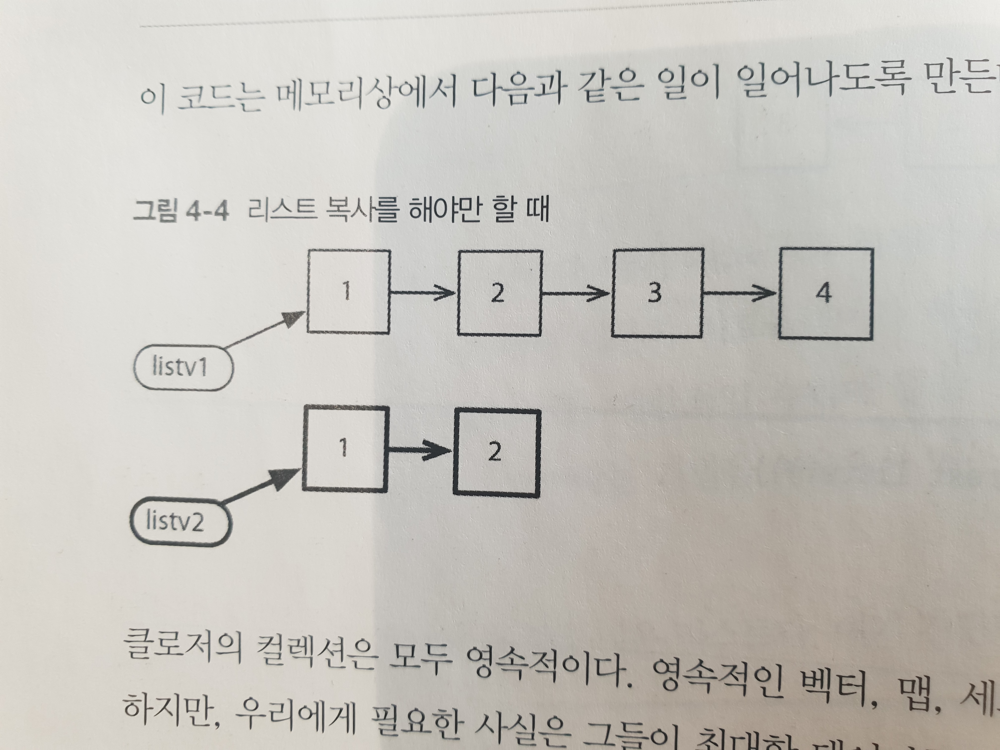

# Chapter 4. 클로저 방식 - 아이데티티를 상태에서 분리하기

클로저는 함수형 프로그래밍과 가변 상태를 결합한 하이브리드 - `클로저만의 방식`을 제공한다.

## 4.1 두 세계의 장점

어떤 문제에 대해서는 함수형 프로그래밍이 특별히 강점을 갖지만, 또 다른 문제에서는 그 대신 상태를 수정하는 것이 필요하기도 하다.

- 이런 때에는 전통적인 상태를 수정하는 방식으로 접근하는 것이 더 쉬울 수 있다.

이번 장에서는 아래를 다룬다.

1. 가변 데이터 타입인 원자(atom)
2. 가변 자료구조인 에이전트와 소프트웨어 트랜잭션 메모리(STM)
3. 원자와 STM을 이용한 알고리즘 구현, 장단점 비교

## 4.2 1일차: 원자와 영속적인 자료구조

> 순수 함수형 언어는 가변 데이터에 대한 지원을 하지 않는다.

클로저는 순수 함수형 언어가 아니다.

- 동시성을 염두해 둔 가변 데이터 타입을 지원한다.
- 이런 타입들이 클로저의 영속적인 자료구조와 함게 사용되면, 가변 상태로 인한 문제를 피할 수 있다.

순수하지 않은 함수형 언어(클로저)와 명령형 언어 사이의 차이는

- 명령형 언어에서 변수는 기본적으로 **가변**이고, 코드는 그럼 변수들을 **수시**로 수정한다.
- 비순수 함수형 언어에서 변수는 기본적으로 **불변**이고, 코드는 그런 변수들을 **꼭 필요한 경우**에 한해 수정한다.

클로저의 가변 변수가 영속적인 자료구조와 함께 사용되면서 아이덴티티를 상태에서 분리할 예정이다.

## 4.2.1 원자

atom은 원자적인 변수이다.

> java.util.concurrent.atomic 기반으로 구현되며 거의 비슷하다.

```clojure
=> (def my-atom (atom 42))
#'user/my-atom
;; atom이 담고 있는 현재 값을 defef 혹은 @을 통해 확인 가능하다.
=> (deref my-atom)
42
=> @my-atom
42
;; swap!은 어떤 함수를 인자로 받아서 그것을 원자의 현재 값에 적용한다.
=> (swap! my-atom inc)
43
=> @my-atom
43
;; 인수로 전달되는 함수에 추가적인 인수를 전달하는 것도 가능하다.
=> (swap! my-atom + 2)
45
;; reset!은 현재 값과 무관한 새로운 값을 설정하는데 사용된다.
=> (reset! my-atom 0)
0
=> @my-atom
0
```

웹 애플리케이션에서는 세션 데이터 저장을 위해 원자적인 맵을 사용하기도 한다.

```clojure
=> (def session (atom {}))
#'user/session
=> (swap! session assoc :username "paul")
{:username "paul"}
=> (swap! session assoc :session-id 1234)
{:username "paul", :session-id 1234}
```

## 4.2.2 가변 상태를 이용하는 멀티스레딩 웹 서비스

토너먼트에 참가한 선수들의 목록을 관리하는 웹 서비스를 통해 영속적인 자료구조가 어떻게 동작하는지 보도록 하자.

```clojure
;; players라는 이름의 원자는 빈 리스트 ()로 초기화된다.
(def players (atom ()))

;; @을 이용해 players의 값을 읽은 다음 선수들의 목록을 JSON 인코딩하여 리턴한다.
(defn list-players []
  (response (json/encode @players)))

;; conj를 사용해서 리스트에 새로운 선수가 추가되고 빈 응답이 201과 함게 리턴된다.
(defn create-player [player-name]
  (swap! players conf player-name)
  (status (response "") 201))

(defroutes app-routes
  (GET "/players" [] (list-players))
  (PUT "/players/:player-name" [player-name] (create-player player-name)))

(defn -main [& args]
  (run-jetty (site app-routes) {:port 3000}))
```

```
➜  ~ curl localhost:3000/players
[]%
➜  ~ curl -X put localhost:3000/players/john
➜  ~ curl localhost:3000/players
["john"]%
➜  ~ curl -X put localhost:3000/players/paul
➜  ~ curl -X put localhost:3000/players/george
➜  ~ curl -X put localhost:3000/players/ringo
➜  ~ curl localhost:3000/players
["ringo","george","paul","john"]%
```

list, create 함수 모두 players에 접근하고 있지만, 클로저의 자료구조는 스레드 안정성을 보장한다.

## 4.2.3 영속적인 자료구조

영속적이라는 말은 값이 수정되었을 때 이전 버전을 영속적으로 보관한다는 것을 의미한다.

- 데이터를 디스크나 데이터베이스에 저장하는 것과 상관없이

그렇기 때문에 수정이 일어나도 겉보기에는 일관성이 유지된다.

```clojure
user=> (def mapv1 {:name "paul" :age 45})
#'user/mapv1
user=> (def mapv2 (assoc mapv1 :sex :male))
#'user/mapv2
user=> mapv1
{:name "paul", :age 45}
user=> mapv2
{:name "paul", :age 45, :sex :male}
```

영속적인 자료구조는 수정이 일어날 때마다 마치 자료구조 전체가 새로운 값으로 복사되는 것처럼 행동한다.

- 복사를 매번 하는 것은 비효율적이기 때문에 자료 공유 기법을 통해 구현된다.

영속적 자료구조를 이해하기 위해 먼저 리스트를 살펴보자.

```clojure
user=> (def listv1 (list 1 2 3))
#'user/listv1
user=> listv1
(1 2 3)
```



```clojure
user=> (def listv2 (cons 4 listv1))
#'user/listv2
user=> listv2
(4 1 2 3)
```



```clojure
user=> (def listv3 (cons 5 (rest listv1)))
#'user/listv3
user=> listv3
(5 2 3)
```



리스트의 경우에는 꼬리 부분이 동일할 때에만 재사용될 수 있기에, 그렇지 않을 때에는 복사를 할 수밖에 없다.

```clojure
user=> (def listv1 (list 1 2 3 4))
#'user/listv1
user=> (def listv2 (take 2 listv1))
#'user/listv2
user=> listv2
(1 2)
```



## 4.2.4 아이덴티티 혹은 상태?

> 똑같은 강물에 두 번 발을 담글 수 없다. 다른 물결이 계속 다가오기 때문이다

영속적 자료구조는 어떤 스레드가 그에 대한 참조를 가진 이후에 다른 스레드에 의해서 그 참조가 변경되지 않으리라는 점을 확신할 수 있게 해준다.

- 이를 통해 아이덴티티를 상태에서 분리한다.

차의 기름의 남은 양은 운전이 계속되면 지속적으로 변화한다.

- 내가 0.5일때 뭔가를 하려고 했다면 처리 중에 이 값은 바뀌지 않는다.

명령형 언어에서 변수는 아이덴티티와 상태를 함께 엮는다.

- 그래서 하나의 아이덴티티는 하나의 값만을 가진다.

영속적 자료구조는 아이덴티티를 상태에서 분리한다.

- 어떤 아이덴티티가 지금 이순간을 나타내는 상태를 읽었다면, 이 상태 자체는 더 이상 변화하지 않는다.
- 대부분의 언어는 강물 전체가 하나의 단일한 값이라는 오류에 집착하지만, 클로저는 강물이 계속 변한다는 사실을 인정한다.

## 4.2.5 재시도

아래처럼 값이 중간에 변경되는 경우 swap!은 같은 동작을 반복하여 이를 원하는 동작을 수행한다.

```
새로운 값 생성
<-- 원자 값 변경
원자 내부의 값 변경
```

그렇기 때문에 swap!에 전달되는 함수는 부작용이 없어야 한다.

- 클로저의 함수적 본질 덕분에 기본적으로 함수형 코드는 부작용이 없다.

## 4.2.6 확인자

원자를 생성할 때 확인자(validator) 함수를 제공할 수 있다.

- 이를 통해 값의 조건을 만족시킬 수 있다.
- 확인자는 swap! 처럼 값이 변하기 직전에 호출되기에 이 또한 부작용이 없어야 한다.

```clj
user=> (def non-negative (atom 0 :validator #(>= % 0)))
#'user/non-negative
user=> (reset! non-negative 42)
42
user=> (reset! non-negative -1)
IllegalStateException Invalid reference state  clojure.lang.ARef.validate (ARef.java:33)
```

## 4.2.7 감시자

원자는 감시자(watcher) 기능도 가질 수 있다.

감시자는 키와 감시 함수를 제공하면 추가할 수 있다.

- 키는 감시자의 아이덴티티를 나타낸다.
- 여러 개의 감시자가 존재할 경우 관련된 키를 통해 참조할 수 있다.
- 감시 함수는 4개의 인수를 받는다.
    1. add-watch에 전달된 키, 
    2. 원자에 대한 참고, 
    3. 이전 값, 
    4. 새로운 값

```clj
user=> (def a (atom 0))
#'user/a
user=> (add-watch a :print #(println "Changed from " %3 " to "%4))
#object[clojure.lang.Atom 0x289710d9 {:status :ready, :val 0}]
user=> (swap! a + 2)
Changed from  0  to  2
2
```

- 감시자는 한번만 호출되기 때문에 부작용이 생겨도 상관은 없다.
- 또한, 원자 자체를 역참조하기보다는 인수로 전달된 %3, %4를 사용하는 것이 좋다.

## 4.2.8 하이브리드 웹 서비스

이전의 웹 서비스는 오직 하나의 데이터 정보만 처리할 수 있어서, 메모리 사용량이 끝없이 상승할 수 있다.

### 세션 관리

세션이라는 개념을 도입해 웹 서비스가 둘 이상의 입력정보를 처리할 수 있도록 만들어보자.

- 각 세션은 다음 방법으로 생성되는 고유한 수를 아이덴티티로 갖는다.

```clj
(def last-session-id (atom 0))
(defn next-session-id []
  (swap! last-session-id inc))
```

```clj
server.core=> (in-ns 'server.session)
#<Namespace server.session>
server.session=> (next-session-id)
1
server.session=> (next-session-id)
2
server.session=> (next-session-id)
3
```

현재 활성화된 세션은 세션 ID와 세션 값을 담는 맵을 저장하는 sessions라는 또 다른 원자를 이용해 관리한다.

```clj
(def sessions (atom {}))

(defn new-session [initial]
  (let [session-id (next-session-id)
    (swap! sessions assoc session-id initial)
    session-id))

(defn get-session [id]
  (@sessions id))
```

### 세션 만료

메모리 사용이 영원이 증가하는 것을 막으려면 사용되지 않는 세션은 삭제해야 한다.

- 세션 만료라는 기능을 사용할 것이다.

```clj
(def sessions (atom {}))

(defn now []
  (System/currentTimeMillis))

(defn new-session [initial]
  (let [session-id (next-session-id)
        session (assoc initial :last-referenced (atom (now)))]
    (swap! sessions assoc session-id session)
    session-id))

(defn get-session [id]
  (let [session (@sessions id)]
    (reset! (:last-referenced session) (now))
    session))
```

현재 시간을 리턴하는 now라는 유틸리티 함수를 추가해서 변경이 발생할 때마다 :last-referenced를 갱신한다.

- 주기적으로 :last-referenced 를 검사해 참조되지 않는 세션을 확인한다.

```clj
(defn session-expiry-time []
  (- (now) (* 10 60 1000)))
(defn expired? [session]
  (< @(:last-referenced session) (session-expiry-time)))

(defn sweep-sessions []
  (swap! sessions #(remove-vals % expired?)))
(def session-sweeper
  (schedule {:min (range 0 60 5)} sweep-sessions))
```

swession-sweeper는 5분마다 sweep-sessions를 실행시킨다.

- 이것이 동작하면 expired?가 true를 리턴하는 세션을 모두 제거(remove-vals)한다.
- 여기서는 10분 이전에 마지막으로 참조된 세션을 모두 제거한다.

### 모두 하나로

세션을 만드는 함수를 만들어보자.

- 여기서도 입력으로 들어오는 정보를 무한한 프라미스의 게으른 열로 표현
- 번역된 내용을 담기 위하여 그 열에 대한 맵 함수를 사용한다.
- 이제는 모두 세션 내에 저장한다.(이전엔 분리하지 않았음)

```clj
(defn create-session []
  (let [snippets (repeatedly promise)
        translations (delay (map translate
                                 (strings->sentences (map deref snippets))))]
    (new-session {:snippets snippets :translations translations})))
```

다음으로 snippets과 translations를 찾아볼 때 세션 내를 찾아보도록 함수를 수정한다.

```clj
(defn accept-snippet [session n text]
  (deliver (nth (:snippets session) n) text))

(defn get-translation [session n]
  @(nth @(:translations session) n))
```

끝으로 이러한 함수들을 URI에 연결해주는 루트를 정의한다.

```clj
(defroutes app-routes
  (POST "/session/create" []
    (response (str (create-session))))

  (context "/session/:session-id" [session-id]
    (let [session (get-session (edn/read-string session-id))]
      (routes
        (PUT "/snippet/:n" [n :as {:keys [body]}]
          (accept-snippet session (edn/read-string n) (slurp body))
          (response "OK"))

        (GET "/translation/:n" [n]
          (response (get-translation session (edn/read-string n))))))))
```

이렇게 하면 웹 서비스가 가변 데이터를 신중한 방식으로 사용하면서도 함수 패러다임의 원칙은 유지할 수 있다.

## 4.2.9 1일 차 마무리

클로저는 가변 변수를 위한 여러 타입을 제공하는 비순수 함수형 언어다. 이번에는 가장 간단한 원자에 대해 살펴보았다.

1. 명령형 언어와 비순수 함수형 언어 사이에 존재하는 차이는 어느 쪽을 강조하는가에 달려있다.
    - 명령형 언어에서 변수는 기본적으로 가변이다. 코드는 변수를 수시로 변경한다.
    - 함수형 언어에서 변수는 기본적으로 불변이다. 코드는 변수를 꼭 필요한 경우에 한해서 변경한다.
2. 함수형 자료구조는 영속적이다.
    - 어느 한 스레드가 구조의 값을 변경해도 이미 구조에 대한 참조를 가지고 있는 다른 스레드에는 영향을 주지 않는다.
3. 이러한 속성은 아이덴티티를 상태에서 분리할 수 있게 한다.
    - 아이덴티티와 연관된 상태가 시간의 흐름에 따라 변하는 값의 열이라는 사실을 인식하는 것이다.